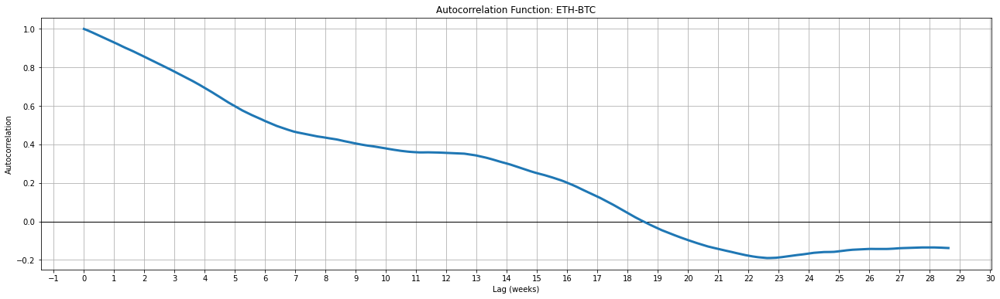
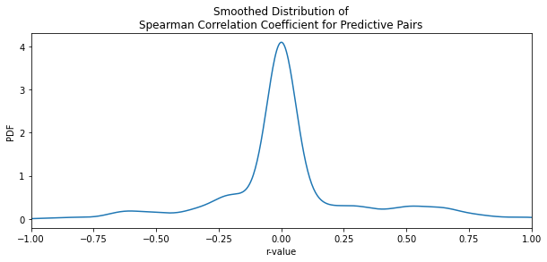
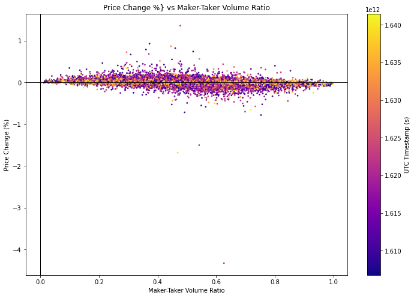

```python
# Includes
# os
import os
from time import sleep
import datetime
from datetime import timezone

# websockets and connectivity
from binance.websockets import BinanceSocketManager
from twisted.internet import reactor

# interactive shell
from IPython.core.interactiveshell import InteractiveShell
InteractiveShell.ast_node_interactivity = "all"

# binance
from binance.client import Client
import binance.helpers as btime

# pandas
import pandas as pd
from pandas import DataFrame as df
pd.set_option("display.max_rows", 100, "display.max_columns", None)
pd.set_option('display.float_format', lambda x: '%.5f' % x)


# numpy
import numpy as np

# plotting
from matplotlib import pyplot as plt
%matplotlib inline
import seaborn as sb
from mpl_toolkits.mplot3d import Axes3D
from statsmodels.graphics import tsaplots


# data science utils
from scipy import stats
from scipy import fft
from scipy import signal
import statsmodels.api as sm
import tensorflow as tf
from tensorflow import keras
from tensorflow.keras import layers
import pingouin as pg

import warnings
warnings.filterwarnings("ignore")

```


```python
# Load api login data

# open api login file
apifile = open("apilogin.txt", "r");
apilogin = (str(apifile.read()).split("\n"));

# extract key
apikey = apilogin[0].split(":")[1];
# extract secret
apisecret = apilogin[1].split(":")[1];

# check values
"key: " + apikey;
"secret: " + apisecret;

client=Client(api_key=apikey,api_secret=apisecret);
```


```python
# define trade pair
base_asset = 'ETH'
quote_asset = 'BTC'
trade_pair = base_asset+quote_asset

# define request interval
time_interval = Client.KLINE_INTERVAL_1MINUTE

# define initial start as utc timestamp
start_time = btime.date_to_milliseconds('Dec 1, 2020')

# request initial historical data
candles = client.get_historical_klines(symbol=trade_pair,interval=time_interval, start_str=start_time,limit=1000)

```


```python
len(candles)
# Verify the last known data point is today
end_unix_timestamp = candles[-1][0]/1000
datetime.datetime.fromtimestamp(end_unix_timestamp)
```


    577020


    datetime.datetime(2022, 1, 6, 9, 22)


```python
# Dynamically name headers
kline_headers = ['Open Time UTC', 
    'Open ' + quote_asset, 
    'High ' + quote_asset, 
    'Low ' + quote_asset, 
    'Close ' + quote_asset, 
    'Volume ' + base_asset, 
    'Close Time UTC', 
    'Volume ' + quote_asset, 
    'Number of Trades',
    'Taker Buy Volume ' + base_asset,
    'Taker Buy Volume ' + quote_asset]
# kline_headers
```


```python
# Create key-value pairs for each column and associated numpy dtype
typedict = {
    kline_headers[0]: np.uint64,
    kline_headers[1]: np.float32,
    kline_headers[2]: np.float32,
    kline_headers[3]: np.float32,
    kline_headers[4]: np.float32,
    kline_headers[5]: np.float32,
    kline_headers[6]: np.uint64,
    kline_headers[7]: np.float32,
    kline_headers[8]: np.float32,
    kline_headers[9]: np.float32,
    kline_headers[10]: np.float32,
}

# Instantiate klines dataframe and assign dtypes via dictionary
klines = df(data=[entry[:-1] for entry in candles], columns=kline_headers).astype(typedict)

# Sort klines dataframe by ascending UTC open
klines.sort_values(by=['Open Time UTC'], ascending=True, inplace=True)

# Assign open UTC as index
klines.index = klines['Open Time UTC']

print('Kline data types:')
klines.dtypes

# klines.head()
```

    Kline data types:
    


    Open Time UTC            uint64
    Open BTC                float32
    High BTC                float32
    Low BTC                 float32
    Close BTC               float32
    Volume ETH              float32
    Close Time UTC           uint64
    Volume BTC              float32
    Number of Trades        float32
    Taker Buy Volume ETH    float32
    Taker Buy Volume BTC    float32
    dtype: object


```python
# calculate close-open differences for each period
klines['Difference ' + quote_asset] = klines['Close ' + quote_asset]-klines['Open ' + quote_asset]
klines['Percent Change ' + quote_asset] = 100 * klines['Difference ' + quote_asset] / klines['Open ' + quote_asset]
klines.head()
```


<div>
<style scoped>
    .dataframe tbody tr th:only-of-type {
        vertical-align: middle;
    }

    .dataframe tbody tr th {
        vertical-align: top;
    }

    .dataframe thead th {
        text-align: right;
    }
</style>
<table border="1" class="dataframe">
  <thead>
    <tr style="text-align: right;">
      <th></th>
      <th>Open Time UTC</th>
      <th>Open BTC</th>
      <th>High BTC</th>
      <th>Low BTC</th>
      <th>Close BTC</th>
      <th>Volume ETH</th>
      <th>Close Time UTC</th>
      <th>Volume BTC</th>
      <th>Number of Trades</th>
      <th>Taker Buy Volume ETH</th>
      <th>Taker Buy Volume BTC</th>
      <th>Difference BTC</th>
      <th>Percent Change BTC</th>
    </tr>
    <tr>
      <th>Open Time UTC</th>
      <th></th>
      <th></th>
      <th></th>
      <th></th>
      <th></th>
      <th></th>
      <th></th>
      <th></th>
      <th></th>
      <th></th>
      <th></th>
      <th></th>
      <th></th>
    </tr>
  </thead>
  <tbody>
    <tr>
      <th>1606780800000</th>
      <td>1606780800000</td>
      <td>0.03131</td>
      <td>0.03132</td>
      <td>0.03125</td>
      <td>0.03125</td>
      <td>332.94400</td>
      <td>1606780859999</td>
      <td>10.41869</td>
      <td>285.00000</td>
      <td>120.16900</td>
      <td>3.76137</td>
      <td>-0.00006</td>
      <td>-0.20121</td>
    </tr>
    <tr>
      <th>1606780860000</th>
      <td>1606780860000</td>
      <td>0.03125</td>
      <td>0.03130</td>
      <td>0.03125</td>
      <td>0.03127</td>
      <td>347.59900</td>
      <td>1606780919999</td>
      <td>10.87070</td>
      <td>246.00000</td>
      <td>169.12000</td>
      <td>5.28886</td>
      <td>0.00002</td>
      <td>0.06081</td>
    </tr>
    <tr>
      <th>1606780920000</th>
      <td>1606780920000</td>
      <td>0.03126</td>
      <td>0.03134</td>
      <td>0.03126</td>
      <td>0.03133</td>
      <td>348.82599</td>
      <td>1606780979999</td>
      <td>10.92332</td>
      <td>232.00000</td>
      <td>252.61099</td>
      <td>7.91123</td>
      <td>0.00007</td>
      <td>0.23030</td>
    </tr>
    <tr>
      <th>1606780980000</th>
      <td>1606780980000</td>
      <td>0.03133</td>
      <td>0.03137</td>
      <td>0.03132</td>
      <td>0.03137</td>
      <td>377.57199</td>
      <td>1606781039999</td>
      <td>11.83920</td>
      <td>302.00000</td>
      <td>284.16000</td>
      <td>8.91018</td>
      <td>0.00004</td>
      <td>0.12127</td>
    </tr>
    <tr>
      <th>1606781040000</th>
      <td>1606781040000</td>
      <td>0.03137</td>
      <td>0.03140</td>
      <td>0.03134</td>
      <td>0.03137</td>
      <td>689.13098</td>
      <td>1606781099999</td>
      <td>21.61878</td>
      <td>317.00000</td>
      <td>462.52200</td>
      <td>14.50975</td>
      <td>-0.00000</td>
      <td>-0.01274</td>
    </tr>
  </tbody>
</table>
</div>


```python
# create Maker-Taker ratio
klines['Maker-Taker Volume ' + quote_asset + ' Ratio'] = ((klines['Volume ' + quote_asset] - klines['Taker Buy Volume ' + quote_asset]) / klines['Volume ' + quote_asset])

# create generic Ratios
klines['Price-Volume ' + quote_asset + ' Ratio'] = klines['Open ' + quote_asset] / klines['Volume ' + quote_asset]
klines['Trade-Volume ' + quote_asset + ' Ratio'] = klines['Number of Trades']/klines['Volume ' + quote_asset]
klines['Price-Taker Buy Volume ' + quote_asset + ' Ratio'] = klines['Open ' + quote_asset] / klines['Taker Buy Volume ' + quote_asset]
klines['Trade-Taker Buy Volume ' + quote_asset + ' Ratio'] = klines['Number of Trades']/klines['Taker Buy Volume ' + quote_asset]
```


```python
# Differentials lagged by 1 timestep
# so that all diff columns are predictors

klines_diff_1 = klines.diff(axis='index',periods=1).shift(1)
klines_diff_1.columns = ['DIFF 1 ' + colname for colname in klines.columns]
klines_diff_1.drop(columns=[klines_diff_1.columns[0], klines_diff_1.columns[6]], inplace=True)

klines_diff_2 = klines.diff(axis='index',periods=2).shift(1)
klines_diff_2.columns = ['DIFF 2 ' + colname for colname in klines.columns]
klines_diff_2.drop(columns=[klines_diff_2.columns[0], klines_diff_2.columns[6]], inplace=True)

klines_diff_3 = klines.diff(axis='index',periods=3).shift(1)
klines_diff_3.columns = ['DIFF 3 ' + colname for colname in klines.columns]
klines_diff_3.drop(columns=[klines_diff_3.columns[0], klines_diff_3.columns[6]], inplace=True)

```


```python
klines = klines.join(klines_diff_1,how='inner').join(klines_diff_2,how='inner').join(klines_diff_3,how='inner')
klines.head()
```


<div>
<style scoped>
    .dataframe tbody tr th:only-of-type {
        vertical-align: middle;
    }

    .dataframe tbody tr th {
        vertical-align: top;
    }

    .dataframe thead th {
        text-align: right;
    }
</style>
<table border="1" class="dataframe">
  <thead>
    <tr style="text-align: right;">
      <th></th>
      <th>Open Time UTC</th>
      <th>Open BTC</th>
      <th>High BTC</th>
      <th>Low BTC</th>
      <th>Close BTC</th>
      <th>Volume ETH</th>
      <th>Close Time UTC</th>
      <th>Volume BTC</th>
      <th>Number of Trades</th>
      <th>Taker Buy Volume ETH</th>
      <th>Taker Buy Volume BTC</th>
      <th>Difference BTC</th>
      <th>Percent Change BTC</th>
      <th>Maker-Taker Volume BTC Ratio</th>
      <th>Price-Volume BTC Ratio</th>
      <th>Trade-Volume BTC Ratio</th>
      <th>Price-Taker Buy Volume BTC Ratio</th>
      <th>Trade-Taker Buy Volume BTC Ratio</th>
      <th>DIFF 1 Open BTC</th>
      <th>DIFF 1 High BTC</th>
      <th>DIFF 1 Low BTC</th>
      <th>DIFF 1 Close BTC</th>
      <th>DIFF 1 Volume ETH</th>
      <th>DIFF 1 Volume BTC</th>
      <th>DIFF 1 Number of Trades</th>
      <th>DIFF 1 Taker Buy Volume ETH</th>
      <th>DIFF 1 Taker Buy Volume BTC</th>
      <th>DIFF 1 Difference BTC</th>
      <th>DIFF 1 Percent Change BTC</th>
      <th>DIFF 1 Maker-Taker Volume BTC Ratio</th>
      <th>DIFF 1 Price-Volume BTC Ratio</th>
      <th>DIFF 1 Trade-Volume BTC Ratio</th>
      <th>DIFF 1 Price-Taker Buy Volume BTC Ratio</th>
      <th>DIFF 1 Trade-Taker Buy Volume BTC Ratio</th>
      <th>DIFF 2 Open BTC</th>
      <th>DIFF 2 High BTC</th>
      <th>DIFF 2 Low BTC</th>
      <th>DIFF 2 Close BTC</th>
      <th>DIFF 2 Volume ETH</th>
      <th>DIFF 2 Volume BTC</th>
      <th>DIFF 2 Number of Trades</th>
      <th>DIFF 2 Taker Buy Volume ETH</th>
      <th>DIFF 2 Taker Buy Volume BTC</th>
      <th>DIFF 2 Difference BTC</th>
      <th>DIFF 2 Percent Change BTC</th>
      <th>DIFF 2 Maker-Taker Volume BTC Ratio</th>
      <th>DIFF 2 Price-Volume BTC Ratio</th>
      <th>DIFF 2 Trade-Volume BTC Ratio</th>
      <th>DIFF 2 Price-Taker Buy Volume BTC Ratio</th>
      <th>DIFF 2 Trade-Taker Buy Volume BTC Ratio</th>
      <th>DIFF 3 Open BTC</th>
      <th>DIFF 3 High BTC</th>
      <th>DIFF 3 Low BTC</th>
      <th>DIFF 3 Close BTC</th>
      <th>DIFF 3 Volume ETH</th>
      <th>DIFF 3 Volume BTC</th>
      <th>DIFF 3 Number of Trades</th>
      <th>DIFF 3 Taker Buy Volume ETH</th>
      <th>DIFF 3 Taker Buy Volume BTC</th>
      <th>DIFF 3 Difference BTC</th>
      <th>DIFF 3 Percent Change BTC</th>
      <th>DIFF 3 Maker-Taker Volume BTC Ratio</th>
      <th>DIFF 3 Price-Volume BTC Ratio</th>
      <th>DIFF 3 Trade-Volume BTC Ratio</th>
      <th>DIFF 3 Price-Taker Buy Volume BTC Ratio</th>
      <th>DIFF 3 Trade-Taker Buy Volume BTC Ratio</th>
    </tr>
    <tr>
      <th>Open Time UTC</th>
      <th></th>
      <th></th>
      <th></th>
      <th></th>
      <th></th>
      <th></th>
      <th></th>
      <th></th>
      <th></th>
      <th></th>
      <th></th>
      <th></th>
      <th></th>
      <th></th>
      <th></th>
      <th></th>
      <th></th>
      <th></th>
      <th></th>
      <th></th>
      <th></th>
      <th></th>
      <th></th>
      <th></th>
      <th></th>
      <th></th>
      <th></th>
      <th></th>
      <th></th>
      <th></th>
      <th></th>
      <th></th>
      <th></th>
      <th></th>
      <th></th>
      <th></th>
      <th></th>
      <th></th>
      <th></th>
      <th></th>
      <th></th>
      <th></th>
      <th></th>
      <th></th>
      <th></th>
      <th></th>
      <th></th>
      <th></th>
      <th></th>
      <th></th>
      <th></th>
      <th></th>
      <th></th>
      <th></th>
      <th></th>
      <th></th>
      <th></th>
      <th></th>
      <th></th>
      <th></th>
      <th></th>
      <th></th>
      <th></th>
      <th></th>
      <th></th>
      <th></th>
    </tr>
  </thead>
  <tbody>
    <tr>
      <th>1606780800000</th>
      <td>1606780800000</td>
      <td>0.03131</td>
      <td>0.03132</td>
      <td>0.03125</td>
      <td>0.03125</td>
      <td>332.94400</td>
      <td>1606780859999</td>
      <td>10.41869</td>
      <td>285.00000</td>
      <td>120.16900</td>
      <td>3.76137</td>
      <td>-0.00006</td>
      <td>-0.20121</td>
      <td>0.63898</td>
      <td>0.00301</td>
      <td>27.35468</td>
      <td>0.00832</td>
      <td>75.77024</td>
      <td>NaN</td>
      <td>NaN</td>
      <td>NaN</td>
      <td>NaN</td>
      <td>NaN</td>
      <td>NaN</td>
      <td>NaN</td>
      <td>NaN</td>
      <td>NaN</td>
      <td>NaN</td>
      <td>NaN</td>
      <td>NaN</td>
      <td>NaN</td>
      <td>NaN</td>
      <td>NaN</td>
      <td>NaN</td>
      <td>NaN</td>
      <td>NaN</td>
      <td>NaN</td>
      <td>NaN</td>
      <td>NaN</td>
      <td>NaN</td>
      <td>NaN</td>
      <td>NaN</td>
      <td>NaN</td>
      <td>NaN</td>
      <td>NaN</td>
      <td>NaN</td>
      <td>NaN</td>
      <td>NaN</td>
      <td>NaN</td>
      <td>NaN</td>
      <td>NaN</td>
      <td>NaN</td>
      <td>NaN</td>
      <td>NaN</td>
      <td>NaN</td>
      <td>NaN</td>
      <td>NaN</td>
      <td>NaN</td>
      <td>NaN</td>
      <td>NaN</td>
      <td>NaN</td>
      <td>NaN</td>
      <td>NaN</td>
      <td>NaN</td>
      <td>NaN</td>
      <td>NaN</td>
    </tr>
    <tr>
      <th>1606780860000</th>
      <td>1606780860000</td>
      <td>0.03125</td>
      <td>0.03130</td>
      <td>0.03125</td>
      <td>0.03127</td>
      <td>347.59900</td>
      <td>1606780919999</td>
      <td>10.87070</td>
      <td>246.00000</td>
      <td>169.12000</td>
      <td>5.28886</td>
      <td>0.00002</td>
      <td>0.06081</td>
      <td>0.51348</td>
      <td>0.00287</td>
      <td>22.62963</td>
      <td>0.00591</td>
      <td>46.51286</td>
      <td>NaN</td>
      <td>NaN</td>
      <td>NaN</td>
      <td>NaN</td>
      <td>NaN</td>
      <td>NaN</td>
      <td>NaN</td>
      <td>NaN</td>
      <td>NaN</td>
      <td>NaN</td>
      <td>NaN</td>
      <td>NaN</td>
      <td>NaN</td>
      <td>NaN</td>
      <td>NaN</td>
      <td>NaN</td>
      <td>NaN</td>
      <td>NaN</td>
      <td>NaN</td>
      <td>NaN</td>
      <td>NaN</td>
      <td>NaN</td>
      <td>NaN</td>
      <td>NaN</td>
      <td>NaN</td>
      <td>NaN</td>
      <td>NaN</td>
      <td>NaN</td>
      <td>NaN</td>
      <td>NaN</td>
      <td>NaN</td>
      <td>NaN</td>
      <td>NaN</td>
      <td>NaN</td>
      <td>NaN</td>
      <td>NaN</td>
      <td>NaN</td>
      <td>NaN</td>
      <td>NaN</td>
      <td>NaN</td>
      <td>NaN</td>
      <td>NaN</td>
      <td>NaN</td>
      <td>NaN</td>
      <td>NaN</td>
      <td>NaN</td>
      <td>NaN</td>
      <td>NaN</td>
    </tr>
    <tr>
      <th>1606780920000</th>
      <td>1606780920000</td>
      <td>0.03126</td>
      <td>0.03134</td>
      <td>0.03126</td>
      <td>0.03133</td>
      <td>348.82599</td>
      <td>1606780979999</td>
      <td>10.92332</td>
      <td>232.00000</td>
      <td>252.61099</td>
      <td>7.91123</td>
      <td>0.00007</td>
      <td>0.23030</td>
      <td>0.27575</td>
      <td>0.00286</td>
      <td>21.23897</td>
      <td>0.00395</td>
      <td>29.32539</td>
      <td>-0.00006</td>
      <td>-0.00002</td>
      <td>0.00000</td>
      <td>0.00002</td>
      <td>14.65500</td>
      <td>0.45201</td>
      <td>-39.00000</td>
      <td>48.95100</td>
      <td>1.52749</td>
      <td>0.00008</td>
      <td>0.26202</td>
      <td>-0.12550</td>
      <td>-0.00013</td>
      <td>-4.72505</td>
      <td>-0.00242</td>
      <td>-29.25738</td>
      <td>NaN</td>
      <td>NaN</td>
      <td>NaN</td>
      <td>NaN</td>
      <td>NaN</td>
      <td>NaN</td>
      <td>NaN</td>
      <td>NaN</td>
      <td>NaN</td>
      <td>NaN</td>
      <td>NaN</td>
      <td>NaN</td>
      <td>NaN</td>
      <td>NaN</td>
      <td>NaN</td>
      <td>NaN</td>
      <td>NaN</td>
      <td>NaN</td>
      <td>NaN</td>
      <td>NaN</td>
      <td>NaN</td>
      <td>NaN</td>
      <td>NaN</td>
      <td>NaN</td>
      <td>NaN</td>
      <td>NaN</td>
      <td>NaN</td>
      <td>NaN</td>
      <td>NaN</td>
      <td>NaN</td>
      <td>NaN</td>
      <td>NaN</td>
    </tr>
    <tr>
      <th>1606780980000</th>
      <td>1606780980000</td>
      <td>0.03133</td>
      <td>0.03137</td>
      <td>0.03132</td>
      <td>0.03137</td>
      <td>377.57199</td>
      <td>1606781039999</td>
      <td>11.83920</td>
      <td>302.00000</td>
      <td>284.16000</td>
      <td>8.91018</td>
      <td>0.00004</td>
      <td>0.12127</td>
      <td>0.24740</td>
      <td>0.00265</td>
      <td>25.50847</td>
      <td>0.00352</td>
      <td>33.89380</td>
      <td>0.00002</td>
      <td>0.00004</td>
      <td>0.00001</td>
      <td>0.00007</td>
      <td>1.22699</td>
      <td>0.05261</td>
      <td>-14.00000</td>
      <td>83.49100</td>
      <td>2.62237</td>
      <td>0.00005</td>
      <td>0.16949</td>
      <td>-0.23773</td>
      <td>-0.00001</td>
      <td>-1.39066</td>
      <td>-0.00196</td>
      <td>-17.18747</td>
      <td>-0.00005</td>
      <td>0.00002</td>
      <td>0.00001</td>
      <td>0.00009</td>
      <td>15.88199</td>
      <td>0.50463</td>
      <td>-53.00000</td>
      <td>132.44199</td>
      <td>4.14986</td>
      <td>0.00013</td>
      <td>0.43151</td>
      <td>-0.36323</td>
      <td>-0.00014</td>
      <td>-6.11571</td>
      <td>-0.00437</td>
      <td>-46.44485</td>
      <td>NaN</td>
      <td>NaN</td>
      <td>NaN</td>
      <td>NaN</td>
      <td>NaN</td>
      <td>NaN</td>
      <td>NaN</td>
      <td>NaN</td>
      <td>NaN</td>
      <td>NaN</td>
      <td>NaN</td>
      <td>NaN</td>
      <td>NaN</td>
      <td>NaN</td>
      <td>NaN</td>
      <td>NaN</td>
    </tr>
    <tr>
      <th>1606781040000</th>
      <td>1606781040000</td>
      <td>0.03137</td>
      <td>0.03140</td>
      <td>0.03134</td>
      <td>0.03137</td>
      <td>689.13098</td>
      <td>1606781099999</td>
      <td>21.61878</td>
      <td>317.00000</td>
      <td>462.52200</td>
      <td>14.50975</td>
      <td>-0.00000</td>
      <td>-0.01274</td>
      <td>0.32884</td>
      <td>0.00145</td>
      <td>14.66317</td>
      <td>0.00216</td>
      <td>21.84738</td>
      <td>0.00007</td>
      <td>0.00003</td>
      <td>0.00006</td>
      <td>0.00004</td>
      <td>28.74600</td>
      <td>0.91588</td>
      <td>70.00000</td>
      <td>31.54901</td>
      <td>0.99895</td>
      <td>-0.00003</td>
      <td>-0.10903</td>
      <td>-0.02835</td>
      <td>-0.00022</td>
      <td>4.26951</td>
      <td>-0.00044</td>
      <td>4.56841</td>
      <td>0.00009</td>
      <td>0.00007</td>
      <td>0.00007</td>
      <td>0.00011</td>
      <td>29.97299</td>
      <td>0.96850</td>
      <td>56.00000</td>
      <td>115.04001</td>
      <td>3.62133</td>
      <td>0.00002</td>
      <td>0.06046</td>
      <td>-0.26608</td>
      <td>-0.00023</td>
      <td>2.87885</td>
      <td>-0.00239</td>
      <td>-12.61906</td>
      <td>0.00002</td>
      <td>0.00005</td>
      <td>0.00007</td>
      <td>0.00013</td>
      <td>44.62799</td>
      <td>1.42051</td>
      <td>17.00000</td>
      <td>163.99100</td>
      <td>5.14881</td>
      <td>0.00010</td>
      <td>0.32248</td>
      <td>-0.39158</td>
      <td>-0.00036</td>
      <td>-1.84620</td>
      <td>-0.00481</td>
      <td>-41.87644</td>
    </tr>
  </tbody>
</table>
</div>


```python
# Verify no NaNs except in first three rows, then remove them in place
klines[klines.isna().any(axis=1)].head()
klines[klines.isna().any(axis=1)].shape
klines.drop(axis='index', labels=klines[klines.isna().any(axis=1)]['Open Time UTC'].values.tolist(),inplace=True)

```


<div>
<style scoped>
    .dataframe tbody tr th:only-of-type {
        vertical-align: middle;
    }

    .dataframe tbody tr th {
        vertical-align: top;
    }

    .dataframe thead th {
        text-align: right;
    }
</style>
<table border="1" class="dataframe">
  <thead>
    <tr style="text-align: right;">
      <th></th>
      <th>Open Time UTC</th>
      <th>Open BTC</th>
      <th>High BTC</th>
      <th>Low BTC</th>
      <th>Close BTC</th>
      <th>Volume ETH</th>
      <th>Close Time UTC</th>
      <th>Volume BTC</th>
      <th>Number of Trades</th>
      <th>Taker Buy Volume ETH</th>
      <th>Taker Buy Volume BTC</th>
      <th>Difference BTC</th>
      <th>Percent Change BTC</th>
      <th>Maker-Taker Volume BTC Ratio</th>
      <th>Price-Volume BTC Ratio</th>
      <th>Trade-Volume BTC Ratio</th>
      <th>Price-Taker Buy Volume BTC Ratio</th>
      <th>Trade-Taker Buy Volume BTC Ratio</th>
      <th>DIFF 1 Open BTC</th>
      <th>DIFF 1 High BTC</th>
      <th>DIFF 1 Low BTC</th>
      <th>DIFF 1 Close BTC</th>
      <th>DIFF 1 Volume ETH</th>
      <th>DIFF 1 Volume BTC</th>
      <th>DIFF 1 Number of Trades</th>
      <th>DIFF 1 Taker Buy Volume ETH</th>
      <th>DIFF 1 Taker Buy Volume BTC</th>
      <th>DIFF 1 Difference BTC</th>
      <th>DIFF 1 Percent Change BTC</th>
      <th>DIFF 1 Maker-Taker Volume BTC Ratio</th>
      <th>DIFF 1 Price-Volume BTC Ratio</th>
      <th>DIFF 1 Trade-Volume BTC Ratio</th>
      <th>DIFF 1 Price-Taker Buy Volume BTC Ratio</th>
      <th>DIFF 1 Trade-Taker Buy Volume BTC Ratio</th>
      <th>DIFF 2 Open BTC</th>
      <th>DIFF 2 High BTC</th>
      <th>DIFF 2 Low BTC</th>
      <th>DIFF 2 Close BTC</th>
      <th>DIFF 2 Volume ETH</th>
      <th>DIFF 2 Volume BTC</th>
      <th>DIFF 2 Number of Trades</th>
      <th>DIFF 2 Taker Buy Volume ETH</th>
      <th>DIFF 2 Taker Buy Volume BTC</th>
      <th>DIFF 2 Difference BTC</th>
      <th>DIFF 2 Percent Change BTC</th>
      <th>DIFF 2 Maker-Taker Volume BTC Ratio</th>
      <th>DIFF 2 Price-Volume BTC Ratio</th>
      <th>DIFF 2 Trade-Volume BTC Ratio</th>
      <th>DIFF 2 Price-Taker Buy Volume BTC Ratio</th>
      <th>DIFF 2 Trade-Taker Buy Volume BTC Ratio</th>
      <th>DIFF 3 Open BTC</th>
      <th>DIFF 3 High BTC</th>
      <th>DIFF 3 Low BTC</th>
      <th>DIFF 3 Close BTC</th>
      <th>DIFF 3 Volume ETH</th>
      <th>DIFF 3 Volume BTC</th>
      <th>DIFF 3 Number of Trades</th>
      <th>DIFF 3 Taker Buy Volume ETH</th>
      <th>DIFF 3 Taker Buy Volume BTC</th>
      <th>DIFF 3 Difference BTC</th>
      <th>DIFF 3 Percent Change BTC</th>
      <th>DIFF 3 Maker-Taker Volume BTC Ratio</th>
      <th>DIFF 3 Price-Volume BTC Ratio</th>
      <th>DIFF 3 Trade-Volume BTC Ratio</th>
      <th>DIFF 3 Price-Taker Buy Volume BTC Ratio</th>
      <th>DIFF 3 Trade-Taker Buy Volume BTC Ratio</th>
    </tr>
    <tr>
      <th>Open Time UTC</th>
      <th></th>
      <th></th>
      <th></th>
      <th></th>
      <th></th>
      <th></th>
      <th></th>
      <th></th>
      <th></th>
      <th></th>
      <th></th>
      <th></th>
      <th></th>
      <th></th>
      <th></th>
      <th></th>
      <th></th>
      <th></th>
      <th></th>
      <th></th>
      <th></th>
      <th></th>
      <th></th>
      <th></th>
      <th></th>
      <th></th>
      <th></th>
      <th></th>
      <th></th>
      <th></th>
      <th></th>
      <th></th>
      <th></th>
      <th></th>
      <th></th>
      <th></th>
      <th></th>
      <th></th>
      <th></th>
      <th></th>
      <th></th>
      <th></th>
      <th></th>
      <th></th>
      <th></th>
      <th></th>
      <th></th>
      <th></th>
      <th></th>
      <th></th>
      <th></th>
      <th></th>
      <th></th>
      <th></th>
      <th></th>
      <th></th>
      <th></th>
      <th></th>
      <th></th>
      <th></th>
      <th></th>
      <th></th>
      <th></th>
      <th></th>
      <th></th>
      <th></th>
    </tr>
  </thead>
  <tbody>
    <tr>
      <th>1606780800000</th>
      <td>1606780800000</td>
      <td>0.03131</td>
      <td>0.03132</td>
      <td>0.03125</td>
      <td>0.03125</td>
      <td>332.94400</td>
      <td>1606780859999</td>
      <td>10.41869</td>
      <td>285.00000</td>
      <td>120.16900</td>
      <td>3.76137</td>
      <td>-0.00006</td>
      <td>-0.20121</td>
      <td>0.63898</td>
      <td>0.00301</td>
      <td>27.35468</td>
      <td>0.00832</td>
      <td>75.77024</td>
      <td>NaN</td>
      <td>NaN</td>
      <td>NaN</td>
      <td>NaN</td>
      <td>NaN</td>
      <td>NaN</td>
      <td>NaN</td>
      <td>NaN</td>
      <td>NaN</td>
      <td>NaN</td>
      <td>NaN</td>
      <td>NaN</td>
      <td>NaN</td>
      <td>NaN</td>
      <td>NaN</td>
      <td>NaN</td>
      <td>NaN</td>
      <td>NaN</td>
      <td>NaN</td>
      <td>NaN</td>
      <td>NaN</td>
      <td>NaN</td>
      <td>NaN</td>
      <td>NaN</td>
      <td>NaN</td>
      <td>NaN</td>
      <td>NaN</td>
      <td>NaN</td>
      <td>NaN</td>
      <td>NaN</td>
      <td>NaN</td>
      <td>NaN</td>
      <td>NaN</td>
      <td>NaN</td>
      <td>NaN</td>
      <td>NaN</td>
      <td>NaN</td>
      <td>NaN</td>
      <td>NaN</td>
      <td>NaN</td>
      <td>NaN</td>
      <td>NaN</td>
      <td>NaN</td>
      <td>NaN</td>
      <td>NaN</td>
      <td>NaN</td>
      <td>NaN</td>
      <td>NaN</td>
    </tr>
    <tr>
      <th>1606780860000</th>
      <td>1606780860000</td>
      <td>0.03125</td>
      <td>0.03130</td>
      <td>0.03125</td>
      <td>0.03127</td>
      <td>347.59900</td>
      <td>1606780919999</td>
      <td>10.87070</td>
      <td>246.00000</td>
      <td>169.12000</td>
      <td>5.28886</td>
      <td>0.00002</td>
      <td>0.06081</td>
      <td>0.51348</td>
      <td>0.00287</td>
      <td>22.62963</td>
      <td>0.00591</td>
      <td>46.51286</td>
      <td>NaN</td>
      <td>NaN</td>
      <td>NaN</td>
      <td>NaN</td>
      <td>NaN</td>
      <td>NaN</td>
      <td>NaN</td>
      <td>NaN</td>
      <td>NaN</td>
      <td>NaN</td>
      <td>NaN</td>
      <td>NaN</td>
      <td>NaN</td>
      <td>NaN</td>
      <td>NaN</td>
      <td>NaN</td>
      <td>NaN</td>
      <td>NaN</td>
      <td>NaN</td>
      <td>NaN</td>
      <td>NaN</td>
      <td>NaN</td>
      <td>NaN</td>
      <td>NaN</td>
      <td>NaN</td>
      <td>NaN</td>
      <td>NaN</td>
      <td>NaN</td>
      <td>NaN</td>
      <td>NaN</td>
      <td>NaN</td>
      <td>NaN</td>
      <td>NaN</td>
      <td>NaN</td>
      <td>NaN</td>
      <td>NaN</td>
      <td>NaN</td>
      <td>NaN</td>
      <td>NaN</td>
      <td>NaN</td>
      <td>NaN</td>
      <td>NaN</td>
      <td>NaN</td>
      <td>NaN</td>
      <td>NaN</td>
      <td>NaN</td>
      <td>NaN</td>
      <td>NaN</td>
    </tr>
    <tr>
      <th>1606780920000</th>
      <td>1606780920000</td>
      <td>0.03126</td>
      <td>0.03134</td>
      <td>0.03126</td>
      <td>0.03133</td>
      <td>348.82599</td>
      <td>1606780979999</td>
      <td>10.92332</td>
      <td>232.00000</td>
      <td>252.61099</td>
      <td>7.91123</td>
      <td>0.00007</td>
      <td>0.23030</td>
      <td>0.27575</td>
      <td>0.00286</td>
      <td>21.23897</td>
      <td>0.00395</td>
      <td>29.32539</td>
      <td>-0.00006</td>
      <td>-0.00002</td>
      <td>0.00000</td>
      <td>0.00002</td>
      <td>14.65500</td>
      <td>0.45201</td>
      <td>-39.00000</td>
      <td>48.95100</td>
      <td>1.52749</td>
      <td>0.00008</td>
      <td>0.26202</td>
      <td>-0.12550</td>
      <td>-0.00013</td>
      <td>-4.72505</td>
      <td>-0.00242</td>
      <td>-29.25738</td>
      <td>NaN</td>
      <td>NaN</td>
      <td>NaN</td>
      <td>NaN</td>
      <td>NaN</td>
      <td>NaN</td>
      <td>NaN</td>
      <td>NaN</td>
      <td>NaN</td>
      <td>NaN</td>
      <td>NaN</td>
      <td>NaN</td>
      <td>NaN</td>
      <td>NaN</td>
      <td>NaN</td>
      <td>NaN</td>
      <td>NaN</td>
      <td>NaN</td>
      <td>NaN</td>
      <td>NaN</td>
      <td>NaN</td>
      <td>NaN</td>
      <td>NaN</td>
      <td>NaN</td>
      <td>NaN</td>
      <td>NaN</td>
      <td>NaN</td>
      <td>NaN</td>
      <td>NaN</td>
      <td>NaN</td>
      <td>NaN</td>
      <td>NaN</td>
    </tr>
    <tr>
      <th>1606780980000</th>
      <td>1606780980000</td>
      <td>0.03133</td>
      <td>0.03137</td>
      <td>0.03132</td>
      <td>0.03137</td>
      <td>377.57199</td>
      <td>1606781039999</td>
      <td>11.83920</td>
      <td>302.00000</td>
      <td>284.16000</td>
      <td>8.91018</td>
      <td>0.00004</td>
      <td>0.12127</td>
      <td>0.24740</td>
      <td>0.00265</td>
      <td>25.50847</td>
      <td>0.00352</td>
      <td>33.89380</td>
      <td>0.00002</td>
      <td>0.00004</td>
      <td>0.00001</td>
      <td>0.00007</td>
      <td>1.22699</td>
      <td>0.05261</td>
      <td>-14.00000</td>
      <td>83.49100</td>
      <td>2.62237</td>
      <td>0.00005</td>
      <td>0.16949</td>
      <td>-0.23773</td>
      <td>-0.00001</td>
      <td>-1.39066</td>
      <td>-0.00196</td>
      <td>-17.18747</td>
      <td>-0.00005</td>
      <td>0.00002</td>
      <td>0.00001</td>
      <td>0.00009</td>
      <td>15.88199</td>
      <td>0.50463</td>
      <td>-53.00000</td>
      <td>132.44199</td>
      <td>4.14986</td>
      <td>0.00013</td>
      <td>0.43151</td>
      <td>-0.36323</td>
      <td>-0.00014</td>
      <td>-6.11571</td>
      <td>-0.00437</td>
      <td>-46.44485</td>
      <td>NaN</td>
      <td>NaN</td>
      <td>NaN</td>
      <td>NaN</td>
      <td>NaN</td>
      <td>NaN</td>
      <td>NaN</td>
      <td>NaN</td>
      <td>NaN</td>
      <td>NaN</td>
      <td>NaN</td>
      <td>NaN</td>
      <td>NaN</td>
      <td>NaN</td>
      <td>NaN</td>
      <td>NaN</td>
    </tr>
    <tr>
      <th>1608556800000</th>
      <td>1608556800000</td>
      <td>0.02686</td>
      <td>0.02686</td>
      <td>0.02686</td>
      <td>0.02686</td>
      <td>0.00000</td>
      <td>1608556859999</td>
      <td>0.00000</td>
      <td>0.00000</td>
      <td>0.00000</td>
      <td>0.00000</td>
      <td>0.00000</td>
      <td>0.00000</td>
      <td>NaN</td>
      <td>inf</td>
      <td>NaN</td>
      <td>inf</td>
      <td>NaN</td>
      <td>-0.00002</td>
      <td>-0.00002</td>
      <td>-0.00000</td>
      <td>0.00002</td>
      <td>-191.71600</td>
      <td>-5.15132</td>
      <td>-129.00000</td>
      <td>-77.51800</td>
      <td>-2.08311</td>
      <td>0.00003</td>
      <td>0.13033</td>
      <td>-0.24780</td>
      <td>0.01576</td>
      <td>6.57903</td>
      <td>0.01894</td>
      <td>-10.53370</td>
      <td>-0.00004</td>
      <td>-0.00003</td>
      <td>-0.00002</td>
      <td>0.00000</td>
      <td>-166.38701</td>
      <td>-4.47386</td>
      <td>-109.00000</td>
      <td>-15.76800</td>
      <td>-0.42478</td>
      <td>0.00005</td>
      <td>0.16746</td>
      <td>-0.47797</td>
      <td>0.01528</td>
      <td>6.89968</td>
      <td>0.00843</td>
      <td>-64.09057</td>
      <td>-0.00007</td>
      <td>-0.00005</td>
      <td>-0.00005</td>
      <td>-0.00003</td>
      <td>-222.13002</td>
      <td>-5.97961</td>
      <td>-73.00000</td>
      <td>-32.16400</td>
      <td>-0.86710</td>
      <td>0.00005</td>
      <td>0.17849</td>
      <td>-0.46675</td>
      <td>0.01622</td>
      <td>17.24460</td>
      <td>0.01307</td>
      <td>-17.81107</td>
    </tr>
  </tbody>
</table>
</div>


    (164, 66)


```python
# Create df for price data only
price_df = df(klines['Open ' + quote_asset])
price_df.columns=['Price']
price_df.head()

# start with 1st order linear model
time_idx = price_df.index.to_numpy()
price = price_df.Price.to_numpy()
order1_regression = stats.linregress(time_idx,price)
order1_prediction = order1_regression.intercept + order1_regression.slope*time_idx
order1_residual = price-order1_prediction
```


<div>
<style scoped>
    .dataframe tbody tr th:only-of-type {
        vertical-align: middle;
    }

    .dataframe tbody tr th {
        vertical-align: top;
    }

    .dataframe thead th {
        text-align: right;
    }
</style>
<table border="1" class="dataframe">
  <thead>
    <tr style="text-align: right;">
      <th></th>
      <th>Price</th>
    </tr>
    <tr>
      <th>Open Time UTC</th>
      <th></th>
    </tr>
  </thead>
  <tbody>
    <tr>
      <th>1606781040000</th>
      <td>0.03137</td>
    </tr>
    <tr>
      <th>1606781100000</th>
      <td>0.03137</td>
    </tr>
    <tr>
      <th>1606781160000</th>
      <td>0.03140</td>
    </tr>
    <tr>
      <th>1606781220000</th>
      <td>0.03138</td>
    </tr>
    <tr>
      <th>1606781280000</th>
      <td>0.03132</td>
    </tr>
  </tbody>
</table>
</div>


```python

# Graph true price vs 1st order approximation
plt.figure(figsize=(20,4));
plt.plot(time_idx, price)
plt.plot(time_idx, order1_prediction)
plt.title('Price History (USD) ')
plt.xlabel('UTC Timestamp (s)')
plt.ylabel('Price ($USD)')

# Graph 1st order residual 
plt.figure(figsize=(20,4))
plt.plot(time_idx, order1_residual)
plt.title('')
```


    <Figure size 1440x288 with 0 Axes>


    [<matplotlib.lines.Line2D at 0x20af1601dc0>]


    [<matplotlib.lines.Line2D at 0x20af161d160>]


    Text(0.5, 1.0, 'Price History (USD) ')


    Text(0.5, 0, 'UTC Timestamp (s)')


    Text(0, 0.5, 'Price ($USD)')


    <Figure size 1440x288 with 0 Axes>


    [<matplotlib.lines.Line2D at 0x20af29299d0>]


    Text(0.5, 1.0, '')


    

    


    

    


```python
# remove DC component of order 1 residual
order1_residual = order1_residual - np.mean(order1_residual)

# n = signal length
n = price.size

# T = spacing
timestep = 1/(24*60) # unit is days
```


```python
# Raw signal FFT
price_fft = fft.fft(order1_residual,norm=None)[1:n//2] # fft amplitude of pair price 
fft_freq = 7*fft.fftfreq(n, timestep)[1:n//2] # cycles per week
fft_period = 1/fft_freq # period in weeks

# Plot FFT by frequency
plt.figure(figsize=(24,8));
ax = plt.gca();
ax.plot(fft_freq[:50], (np.abs(price_fft[:50])),linewidth=1);
plt.grid();
plt.title('Discrete Fourier Transform: ' + base_asset + '-' + quote_asset);
plt.ylabel('Price Amplitude');
plt.xlabel('Cycles/week');
plt.gca().xaxis.set_minor_locator(plt.MultipleLocator(1/7));
plt.gca().xaxis.set_major_locator(plt.MultipleLocator(1));

# # Plot FFT by wavelength
# plt.figure(figsize=(24,8))
# ax = plt.gca()
# ax.plot(fft_period, (np.abs(price_fft)),linewidth=1,marker='o')
# plt.grid()
# plt.title('Discrete Fourier Transform: ' + base_asset + '-' + quote_asset)
# plt.ylabel('Price Amplitude');
# plt.xlabel('Period (week)');
```


    

    


```python
fft_data = df(data=[np.abs(price_fft[0:10]),fft_freq[0:10]],index=['Price Amplitude','Cycles per Week']).transpose()
fft_data['Cycle Period (Days)'] = 7/fft_data['Cycles per Week']
fft_data
```


<div>
<style scoped>
    .dataframe tbody tr th:only-of-type {
        vertical-align: middle;
    }

    .dataframe tbody tr th {
        vertical-align: top;
    }

    .dataframe thead th {
        text-align: right;
    }
</style>
<table border="1" class="dataframe">
  <thead>
    <tr style="text-align: right;">
      <th></th>
      <th>Price Amplitude</th>
      <th>Cycles per Week</th>
      <th>Cycle Period (Days)</th>
    </tr>
  </thead>
  <tbody>
    <tr>
      <th>0</th>
      <td>1382.18137</td>
      <td>0.01747</td>
      <td>400.59444</td>
    </tr>
    <tr>
      <th>1</th>
      <td>1550.17458</td>
      <td>0.03495</td>
      <td>200.29722</td>
    </tr>
    <tr>
      <th>2</th>
      <td>1205.60322</td>
      <td>0.05242</td>
      <td>133.53148</td>
    </tr>
    <tr>
      <th>3</th>
      <td>1778.98307</td>
      <td>0.06990</td>
      <td>100.14861</td>
    </tr>
    <tr>
      <th>4</th>
      <td>275.45627</td>
      <td>0.08737</td>
      <td>80.11889</td>
    </tr>
    <tr>
      <th>5</th>
      <td>179.75720</td>
      <td>0.10484</td>
      <td>66.76574</td>
    </tr>
    <tr>
      <th>6</th>
      <td>546.25039</td>
      <td>0.12232</td>
      <td>57.22778</td>
    </tr>
    <tr>
      <th>7</th>
      <td>339.33163</td>
      <td>0.13979</td>
      <td>50.07431</td>
    </tr>
    <tr>
      <th>8</th>
      <td>277.48344</td>
      <td>0.15727</td>
      <td>44.51049</td>
    </tr>
    <tr>
      <th>9</th>
      <td>347.98698</td>
      <td>0.17474</td>
      <td>40.05944</td>
    </tr>
  </tbody>
</table>
</div>


```python
# Raw signal
order0_residual = price-np.mean(price) # remove DC component
ac_residual = np.correlate(order0_residual, order0_residual, 'same')[n//2+1:] # calucate autocorrelation
ac_residual /= ac_residual[0] # normalize by first value

lag = np.arange(len(ac_residual))*(1/(60*24))/7 # lag in weeks

# plot autocorrelation
plt.figure(figsize=(22,6));
ax = plt.gca();
plt.axhline(y=0, color='k',linewidth=1);
plt.plot(lag, ac_residual, linewidth=3);
plt.grid();
plt.title('Autocorrelation Function: ' + base_asset + '-' + quote_asset);
plt.ylabel('Autocorrelation');
plt.xlabel('Lag (weeks)');
ax.xaxis.set_major_locator(plt.MultipleLocator(1));
```


    

    


```python
# Partial Autocorrelation
plt.figure(figsize=(20,4));
pac = sm.tsa.stattools.pacf(order0_residual, nlags=500, method='ld');
plt.plot(np.arange(len(pac)), pac, linewidth=3);
plt.grid();
plt.title('Partial Autocorrelation Function: ' + base_asset + '-' + quote_asset);
plt.ylabel('Partial Correlation Coefficient');
plt.xlabel('Lag (minutes)');


```


    

    


```python
# Drop time columns as DF in indexed by UTC timestamp
complete_data = klines.drop(['Open Time UTC','Close Time UTC'],axis='columns')

# add lagged data to complete_data
lag1 = complete_data.shift(1).drop(labels=['Open ' + quote_asset, 'High ' + quote_asset, 'Low ' + quote_asset, 'Close ' + quote_asset],axis='columns').drop(labels=[x for x in klines.columns if 'DIFF ' in x], axis='columns').rename(columns={x: 'LAG 1 ' + x for x in klines.columns})
lag2 = complete_data.shift(2).drop(labels=['Open ' + quote_asset, 'High ' + quote_asset, 'Low ' + quote_asset, 'Close ' + quote_asset],axis='columns').drop(labels=[x for x in klines.columns if 'DIFF ' in x], axis='columns').rename(columns={x: 'LAG 2 ' + x for x in klines.columns})
lag3 = complete_data.shift(3).drop(labels=['Open ' + quote_asset, 'High ' + quote_asset, 'Low ' + quote_asset, 'Close ' + quote_asset],axis='columns').drop(labels=[x for x in klines.columns if 'DIFF ' in x], axis='columns').rename(columns={x: 'LAG 3 ' + x for x in klines.columns})

complete_data = complete_data.join(other=[lag1,lag2,lag3],how='inner').dropna()

```


```python
# df(complete_data.columns)
complete_data.head()
print('Augmented Kline data shape: ')
complete_data.shape
```


<div>
<style scoped>
    .dataframe tbody tr th:only-of-type {
        vertical-align: middle;
    }

    .dataframe tbody tr th {
        vertical-align: top;
    }

    .dataframe thead th {
        text-align: right;
    }
</style>
<table border="1" class="dataframe">
  <thead>
    <tr style="text-align: right;">
      <th></th>
      <th>Open BTC</th>
      <th>High BTC</th>
      <th>Low BTC</th>
      <th>Close BTC</th>
      <th>Volume ETH</th>
      <th>Volume BTC</th>
      <th>Number of Trades</th>
      <th>Taker Buy Volume ETH</th>
      <th>Taker Buy Volume BTC</th>
      <th>Difference BTC</th>
      <th>Percent Change BTC</th>
      <th>Maker-Taker Volume BTC Ratio</th>
      <th>Price-Volume BTC Ratio</th>
      <th>Trade-Volume BTC Ratio</th>
      <th>Price-Taker Buy Volume BTC Ratio</th>
      <th>Trade-Taker Buy Volume BTC Ratio</th>
      <th>DIFF 1 Open BTC</th>
      <th>DIFF 1 High BTC</th>
      <th>DIFF 1 Low BTC</th>
      <th>DIFF 1 Close BTC</th>
      <th>DIFF 1 Volume ETH</th>
      <th>DIFF 1 Volume BTC</th>
      <th>DIFF 1 Number of Trades</th>
      <th>DIFF 1 Taker Buy Volume ETH</th>
      <th>DIFF 1 Taker Buy Volume BTC</th>
      <th>DIFF 1 Difference BTC</th>
      <th>DIFF 1 Percent Change BTC</th>
      <th>DIFF 1 Maker-Taker Volume BTC Ratio</th>
      <th>DIFF 1 Price-Volume BTC Ratio</th>
      <th>DIFF 1 Trade-Volume BTC Ratio</th>
      <th>DIFF 1 Price-Taker Buy Volume BTC Ratio</th>
      <th>DIFF 1 Trade-Taker Buy Volume BTC Ratio</th>
      <th>DIFF 2 Open BTC</th>
      <th>DIFF 2 High BTC</th>
      <th>DIFF 2 Low BTC</th>
      <th>DIFF 2 Close BTC</th>
      <th>DIFF 2 Volume ETH</th>
      <th>DIFF 2 Volume BTC</th>
      <th>DIFF 2 Number of Trades</th>
      <th>DIFF 2 Taker Buy Volume ETH</th>
      <th>DIFF 2 Taker Buy Volume BTC</th>
      <th>DIFF 2 Difference BTC</th>
      <th>DIFF 2 Percent Change BTC</th>
      <th>DIFF 2 Maker-Taker Volume BTC Ratio</th>
      <th>DIFF 2 Price-Volume BTC Ratio</th>
      <th>DIFF 2 Trade-Volume BTC Ratio</th>
      <th>DIFF 2 Price-Taker Buy Volume BTC Ratio</th>
      <th>DIFF 2 Trade-Taker Buy Volume BTC Ratio</th>
      <th>DIFF 3 Open BTC</th>
      <th>DIFF 3 High BTC</th>
      <th>DIFF 3 Low BTC</th>
      <th>DIFF 3 Close BTC</th>
      <th>DIFF 3 Volume ETH</th>
      <th>DIFF 3 Volume BTC</th>
      <th>DIFF 3 Number of Trades</th>
      <th>DIFF 3 Taker Buy Volume ETH</th>
      <th>DIFF 3 Taker Buy Volume BTC</th>
      <th>DIFF 3 Difference BTC</th>
      <th>DIFF 3 Percent Change BTC</th>
      <th>DIFF 3 Maker-Taker Volume BTC Ratio</th>
      <th>DIFF 3 Price-Volume BTC Ratio</th>
      <th>DIFF 3 Trade-Volume BTC Ratio</th>
      <th>DIFF 3 Price-Taker Buy Volume BTC Ratio</th>
      <th>DIFF 3 Trade-Taker Buy Volume BTC Ratio</th>
      <th>LAG 1 Volume ETH</th>
      <th>LAG 1 Volume BTC</th>
      <th>LAG 1 Number of Trades</th>
      <th>LAG 1 Taker Buy Volume ETH</th>
      <th>LAG 1 Taker Buy Volume BTC</th>
      <th>LAG 1 Difference BTC</th>
      <th>LAG 1 Percent Change BTC</th>
      <th>LAG 1 Maker-Taker Volume BTC Ratio</th>
      <th>LAG 1 Price-Volume BTC Ratio</th>
      <th>LAG 1 Trade-Volume BTC Ratio</th>
      <th>LAG 1 Price-Taker Buy Volume BTC Ratio</th>
      <th>LAG 1 Trade-Taker Buy Volume BTC Ratio</th>
      <th>LAG 2 Volume ETH</th>
      <th>LAG 2 Volume BTC</th>
      <th>LAG 2 Number of Trades</th>
      <th>LAG 2 Taker Buy Volume ETH</th>
      <th>LAG 2 Taker Buy Volume BTC</th>
      <th>LAG 2 Difference BTC</th>
      <th>LAG 2 Percent Change BTC</th>
      <th>LAG 2 Maker-Taker Volume BTC Ratio</th>
      <th>LAG 2 Price-Volume BTC Ratio</th>
      <th>LAG 2 Trade-Volume BTC Ratio</th>
      <th>LAG 2 Price-Taker Buy Volume BTC Ratio</th>
      <th>LAG 2 Trade-Taker Buy Volume BTC Ratio</th>
      <th>LAG 3 Volume ETH</th>
      <th>LAG 3 Volume BTC</th>
      <th>LAG 3 Number of Trades</th>
      <th>LAG 3 Taker Buy Volume ETH</th>
      <th>LAG 3 Taker Buy Volume BTC</th>
      <th>LAG 3 Difference BTC</th>
      <th>LAG 3 Percent Change BTC</th>
      <th>LAG 3 Maker-Taker Volume BTC Ratio</th>
      <th>LAG 3 Price-Volume BTC Ratio</th>
      <th>LAG 3 Trade-Volume BTC Ratio</th>
      <th>LAG 3 Price-Taker Buy Volume BTC Ratio</th>
      <th>LAG 3 Trade-Taker Buy Volume BTC Ratio</th>
    </tr>
    <tr>
      <th>Open Time UTC</th>
      <th></th>
      <th></th>
      <th></th>
      <th></th>
      <th></th>
      <th></th>
      <th></th>
      <th></th>
      <th></th>
      <th></th>
      <th></th>
      <th></th>
      <th></th>
      <th></th>
      <th></th>
      <th></th>
      <th></th>
      <th></th>
      <th></th>
      <th></th>
      <th></th>
      <th></th>
      <th></th>
      <th></th>
      <th></th>
      <th></th>
      <th></th>
      <th></th>
      <th></th>
      <th></th>
      <th></th>
      <th></th>
      <th></th>
      <th></th>
      <th></th>
      <th></th>
      <th></th>
      <th></th>
      <th></th>
      <th></th>
      <th></th>
      <th></th>
      <th></th>
      <th></th>
      <th></th>
      <th></th>
      <th></th>
      <th></th>
      <th></th>
      <th></th>
      <th></th>
      <th></th>
      <th></th>
      <th></th>
      <th></th>
      <th></th>
      <th></th>
      <th></th>
      <th></th>
      <th></th>
      <th></th>
      <th></th>
      <th></th>
      <th></th>
      <th></th>
      <th></th>
      <th></th>
      <th></th>
      <th></th>
      <th></th>
      <th></th>
      <th></th>
      <th></th>
      <th></th>
      <th></th>
      <th></th>
      <th></th>
      <th></th>
      <th></th>
      <th></th>
      <th></th>
      <th></th>
      <th></th>
      <th></th>
      <th></th>
      <th></th>
      <th></th>
      <th></th>
      <th></th>
      <th></th>
      <th></th>
      <th></th>
      <th></th>
      <th></th>
      <th></th>
      <th></th>
      <th></th>
      <th></th>
      <th></th>
      <th></th>
    </tr>
  </thead>
  <tbody>
    <tr>
      <th>1606781220000</th>
      <td>0.03138</td>
      <td>0.03138</td>
      <td>0.03132</td>
      <td>0.03132</td>
      <td>242.86301</td>
      <td>7.61350</td>
      <td>177.00000</td>
      <td>93.79800</td>
      <td>2.94024</td>
      <td>-0.00006</td>
      <td>-0.19118</td>
      <td>0.61381</td>
      <td>0.00412</td>
      <td>23.24816</td>
      <td>0.01067</td>
      <td>60.19922</td>
      <td>0.00004</td>
      <td>0.00002</td>
      <td>0.00001</td>
      <td>-0.00002</td>
      <td>297.32901</td>
      <td>9.35025</td>
      <td>155.00000</td>
      <td>-73.14999</td>
      <td>-2.29353</td>
      <td>-0.00006</td>
      <td>-0.19439</td>
      <td>0.37379</td>
      <td>-0.00119</td>
      <td>-1.17909</td>
      <td>0.00221</td>
      <td>48.90896</td>
      <td>0.00003</td>
      <td>0.00003</td>
      <td>0.00004</td>
      <td>0.00001</td>
      <td>-19.08398</td>
      <td>-0.56900</td>
      <td>63.00000</td>
      <td>-313.46399</td>
      <td>-9.82796</td>
      <td>-0.00002</td>
      <td>-0.05094</td>
      <td>0.44875</td>
      <td>0.00004</td>
      <td>3.38927</td>
      <td>0.00455</td>
      <td>59.31818</td>
      <td>0.00007</td>
      <td>0.00005</td>
      <td>0.00006</td>
      <td>0.00001</td>
      <td>292.47501</td>
      <td>9.21058</td>
      <td>78.00000</td>
      <td>-135.10201</td>
      <td>-4.22840</td>
      <td>-0.00006</td>
      <td>-0.18494</td>
      <td>0.53018</td>
      <td>-0.00115</td>
      <td>-7.45603</td>
      <td>0.00319</td>
      <td>47.27176</td>
      <td>670.04700</td>
      <td>21.04978</td>
      <td>380.00000</td>
      <td>149.05800</td>
      <td>4.68179</td>
      <td>-0.00002</td>
      <td>-0.06368</td>
      <td>0.77758</td>
      <td>0.00149</td>
      <td>18.05244</td>
      <td>0.00671</td>
      <td>81.16556</td>
      <td>372.71799</td>
      <td>11.69953</td>
      <td>225.00000</td>
      <td>222.20799</td>
      <td>6.97532</td>
      <td>0.00004</td>
      <td>0.13071</td>
      <td>0.40380</td>
      <td>0.00268</td>
      <td>19.23153</td>
      <td>0.00450</td>
      <td>32.25660</td>
      <td>689.13098</td>
      <td>21.61878</td>
      <td>317.00000</td>
      <td>462.52200</td>
      <td>14.50975</td>
      <td>-0.00000</td>
      <td>-0.01274</td>
      <td>0.32884</td>
      <td>0.00145</td>
      <td>14.66317</td>
      <td>0.00216</td>
      <td>21.84738</td>
    </tr>
    <tr>
      <th>1606781280000</th>
      <td>0.03132</td>
      <td>0.03134</td>
      <td>0.03132</td>
      <td>0.03134</td>
      <td>120.73700</td>
      <td>3.78288</td>
      <td>106.00000</td>
      <td>59.62500</td>
      <td>1.86821</td>
      <td>0.00002</td>
      <td>0.06386</td>
      <td>0.50614</td>
      <td>0.00828</td>
      <td>28.02096</td>
      <td>0.01677</td>
      <td>56.73886</td>
      <td>-0.00002</td>
      <td>-0.00005</td>
      <td>-0.00006</td>
      <td>-0.00006</td>
      <td>-427.18399</td>
      <td>-13.43628</td>
      <td>-203.00000</td>
      <td>-55.26000</td>
      <td>-1.74155</td>
      <td>-0.00004</td>
      <td>-0.12751</td>
      <td>-0.16377</td>
      <td>0.00263</td>
      <td>5.19572</td>
      <td>0.00397</td>
      <td>-20.96634</td>
      <td>0.00002</td>
      <td>-0.00003</td>
      <td>-0.00004</td>
      <td>-0.00008</td>
      <td>-129.85498</td>
      <td>-4.08603</td>
      <td>-48.00000</td>
      <td>-128.41000</td>
      <td>-4.03508</td>
      <td>-0.00010</td>
      <td>-0.32190</td>
      <td>0.21002</td>
      <td>0.00144</td>
      <td>4.01663</td>
      <td>0.00618</td>
      <td>27.94262</td>
      <td>0.00001</td>
      <td>-0.00001</td>
      <td>-0.00002</td>
      <td>-0.00005</td>
      <td>-446.26797</td>
      <td>-14.00528</td>
      <td>-140.00000</td>
      <td>-368.72400</td>
      <td>-11.56951</td>
      <td>-0.00006</td>
      <td>-0.17844</td>
      <td>0.28498</td>
      <td>0.00267</td>
      <td>8.58499</td>
      <td>0.00851</td>
      <td>38.35184</td>
      <td>242.86301</td>
      <td>7.61350</td>
      <td>177.00000</td>
      <td>93.79800</td>
      <td>2.94024</td>
      <td>-0.00006</td>
      <td>-0.19118</td>
      <td>0.61381</td>
      <td>0.00412</td>
      <td>23.24816</td>
      <td>0.01067</td>
      <td>60.19922</td>
      <td>670.04700</td>
      <td>21.04978</td>
      <td>380.00000</td>
      <td>149.05800</td>
      <td>4.68179</td>
      <td>-0.00002</td>
      <td>-0.06368</td>
      <td>0.77758</td>
      <td>0.00149</td>
      <td>18.05244</td>
      <td>0.00671</td>
      <td>81.16556</td>
      <td>372.71799</td>
      <td>11.69953</td>
      <td>225.00000</td>
      <td>222.20799</td>
      <td>6.97532</td>
      <td>0.00004</td>
      <td>0.13071</td>
      <td>0.40380</td>
      <td>0.00268</td>
      <td>19.23153</td>
      <td>0.00450</td>
      <td>32.25660</td>
    </tr>
    <tr>
      <th>1606781340000</th>
      <td>0.03135</td>
      <td>0.03136</td>
      <td>0.03132</td>
      <td>0.03132</td>
      <td>85.66000</td>
      <td>2.68420</td>
      <td>107.00000</td>
      <td>48.02700</td>
      <td>1.50500</td>
      <td>-0.00003</td>
      <td>-0.09252</td>
      <td>0.43931</td>
      <td>0.01168</td>
      <td>39.86286</td>
      <td>0.02083</td>
      <td>71.09628</td>
      <td>-0.00006</td>
      <td>-0.00004</td>
      <td>-0.00000</td>
      <td>0.00002</td>
      <td>-122.12601</td>
      <td>-3.83062</td>
      <td>-71.00000</td>
      <td>-34.17300</td>
      <td>-1.07203</td>
      <td>0.00008</td>
      <td>0.25504</td>
      <td>-0.10767</td>
      <td>0.00416</td>
      <td>4.77280</td>
      <td>0.00609</td>
      <td>-3.46035</td>
      <td>-0.00008</td>
      <td>-0.00009</td>
      <td>-0.00006</td>
      <td>-0.00004</td>
      <td>-549.31000</td>
      <td>-17.26690</td>
      <td>-274.00000</td>
      <td>-89.43300</td>
      <td>-2.81358</td>
      <td>0.00004</td>
      <td>0.12753</td>
      <td>-0.27144</td>
      <td>0.00679</td>
      <td>9.96852</td>
      <td>0.01006</td>
      <td>-24.42669</td>
      <td>-0.00005</td>
      <td>-0.00007</td>
      <td>-0.00005</td>
      <td>-0.00007</td>
      <td>-251.98099</td>
      <td>-7.91665</td>
      <td>-119.00000</td>
      <td>-162.58299</td>
      <td>-5.10711</td>
      <td>-0.00002</td>
      <td>-0.06686</td>
      <td>0.10235</td>
      <td>0.00560</td>
      <td>8.78943</td>
      <td>0.01227</td>
      <td>24.48227</td>
      <td>120.73700</td>
      <td>3.78288</td>
      <td>106.00000</td>
      <td>59.62500</td>
      <td>1.86821</td>
      <td>0.00002</td>
      <td>0.06386</td>
      <td>0.50614</td>
      <td>0.00828</td>
      <td>28.02096</td>
      <td>0.01677</td>
      <td>56.73886</td>
      <td>242.86301</td>
      <td>7.61350</td>
      <td>177.00000</td>
      <td>93.79800</td>
      <td>2.94024</td>
      <td>-0.00006</td>
      <td>-0.19118</td>
      <td>0.61381</td>
      <td>0.00412</td>
      <td>23.24816</td>
      <td>0.01067</td>
      <td>60.19922</td>
      <td>670.04700</td>
      <td>21.04978</td>
      <td>380.00000</td>
      <td>149.05800</td>
      <td>4.68179</td>
      <td>-0.00002</td>
      <td>-0.06368</td>
      <td>0.77758</td>
      <td>0.00149</td>
      <td>18.05244</td>
      <td>0.00671</td>
      <td>81.16556</td>
    </tr>
    <tr>
      <th>1606781400000</th>
      <td>0.03132</td>
      <td>0.03133</td>
      <td>0.03128</td>
      <td>0.03129</td>
      <td>241.74100</td>
      <td>7.56672</td>
      <td>134.00000</td>
      <td>57.44500</td>
      <td>1.79795</td>
      <td>-0.00003</td>
      <td>-0.10854</td>
      <td>0.76239</td>
      <td>0.00414</td>
      <td>17.70913</td>
      <td>0.01742</td>
      <td>74.52953</td>
      <td>0.00002</td>
      <td>0.00001</td>
      <td>-0.00000</td>
      <td>-0.00003</td>
      <td>-35.07700</td>
      <td>-1.09868</td>
      <td>1.00000</td>
      <td>-11.59800</td>
      <td>-0.36321</td>
      <td>-0.00005</td>
      <td>-0.15638</td>
      <td>-0.06683</td>
      <td>0.00340</td>
      <td>11.84190</td>
      <td>0.00406</td>
      <td>14.35741</td>
      <td>-0.00004</td>
      <td>-0.00003</td>
      <td>-0.00001</td>
      <td>-0.00001</td>
      <td>-157.20300</td>
      <td>-4.92930</td>
      <td>-70.00000</td>
      <td>-45.77100</td>
      <td>-1.43524</td>
      <td>0.00003</td>
      <td>0.09866</td>
      <td>-0.17450</td>
      <td>0.00756</td>
      <td>16.61470</td>
      <td>0.01015</td>
      <td>10.89706</td>
      <td>-0.00006</td>
      <td>-0.00007</td>
      <td>-0.00006</td>
      <td>-0.00007</td>
      <td>-584.38696</td>
      <td>-18.36558</td>
      <td>-273.00000</td>
      <td>-101.03100</td>
      <td>-3.17679</td>
      <td>-0.00001</td>
      <td>-0.02884</td>
      <td>-0.33827</td>
      <td>0.01019</td>
      <td>21.81042</td>
      <td>0.01412</td>
      <td>-10.06928</td>
      <td>85.66000</td>
      <td>2.68420</td>
      <td>107.00000</td>
      <td>48.02700</td>
      <td>1.50500</td>
      <td>-0.00003</td>
      <td>-0.09252</td>
      <td>0.43931</td>
      <td>0.01168</td>
      <td>39.86286</td>
      <td>0.02083</td>
      <td>71.09628</td>
      <td>120.73700</td>
      <td>3.78288</td>
      <td>106.00000</td>
      <td>59.62500</td>
      <td>1.86821</td>
      <td>0.00002</td>
      <td>0.06386</td>
      <td>0.50614</td>
      <td>0.00828</td>
      <td>28.02096</td>
      <td>0.01677</td>
      <td>56.73886</td>
      <td>242.86301</td>
      <td>7.61350</td>
      <td>177.00000</td>
      <td>93.79800</td>
      <td>2.94024</td>
      <td>-0.00006</td>
      <td>-0.19118</td>
      <td>0.61381</td>
      <td>0.00412</td>
      <td>23.24816</td>
      <td>0.01067</td>
      <td>60.19922</td>
    </tr>
    <tr>
      <th>1606781460000</th>
      <td>0.03129</td>
      <td>0.03129</td>
      <td>0.03126</td>
      <td>0.03128</td>
      <td>322.33600</td>
      <td>10.07831</td>
      <td>172.00000</td>
      <td>64.43000</td>
      <td>2.01451</td>
      <td>-0.00002</td>
      <td>-0.05113</td>
      <td>0.80011</td>
      <td>0.00310</td>
      <td>17.06636</td>
      <td>0.01553</td>
      <td>85.38051</td>
      <td>-0.00002</td>
      <td>-0.00002</td>
      <td>-0.00003</td>
      <td>-0.00003</td>
      <td>156.08099</td>
      <td>4.88252</td>
      <td>27.00000</td>
      <td>9.41800</td>
      <td>0.29294</td>
      <td>-0.00000</td>
      <td>-0.01602</td>
      <td>0.32308</td>
      <td>-0.00754</td>
      <td>-22.15373</td>
      <td>-0.00341</td>
      <td>3.43326</td>
      <td>0.00000</td>
      <td>-0.00001</td>
      <td>-0.00004</td>
      <td>-0.00005</td>
      <td>121.00400</td>
      <td>3.78384</td>
      <td>28.00000</td>
      <td>-2.18000</td>
      <td>-0.07026</td>
      <td>-0.00005</td>
      <td>-0.17240</td>
      <td>0.25625</td>
      <td>-0.00414</td>
      <td>-10.31183</td>
      <td>0.00066</td>
      <td>17.79067</td>
      <td>-0.00006</td>
      <td>-0.00005</td>
      <td>-0.00004</td>
      <td>-0.00003</td>
      <td>-1.12201</td>
      <td>-0.04679</td>
      <td>-43.00000</td>
      <td>-36.35300</td>
      <td>-1.14229</td>
      <td>0.00003</td>
      <td>0.08264</td>
      <td>0.14857</td>
      <td>0.00002</td>
      <td>-5.53903</td>
      <td>0.00675</td>
      <td>14.33031</td>
      <td>241.74100</td>
      <td>7.56672</td>
      <td>134.00000</td>
      <td>57.44500</td>
      <td>1.79795</td>
      <td>-0.00003</td>
      <td>-0.10854</td>
      <td>0.76239</td>
      <td>0.00414</td>
      <td>17.70913</td>
      <td>0.01742</td>
      <td>74.52953</td>
      <td>85.66000</td>
      <td>2.68420</td>
      <td>107.00000</td>
      <td>48.02700</td>
      <td>1.50500</td>
      <td>-0.00003</td>
      <td>-0.09252</td>
      <td>0.43931</td>
      <td>0.01168</td>
      <td>39.86286</td>
      <td>0.02083</td>
      <td>71.09628</td>
      <td>120.73700</td>
      <td>3.78288</td>
      <td>106.00000</td>
      <td>59.62500</td>
      <td>1.86821</td>
      <td>0.00002</td>
      <td>0.06386</td>
      <td>0.50614</td>
      <td>0.00828</td>
      <td>28.02096</td>
      <td>0.01677</td>
      <td>56.73886</td>
    </tr>
  </tbody>
</table>
</div>


    Augmented Kline data shape: 
    


    (576853, 100)


```python
# Plot correlation between pairs except for lag
# pairplot = sb.pairplot(complete_data[[col for col in complete_data.columns if 'LAG' not in col]].sample(n=1600, axis='index'), diag_kind='kde', kind='scatter',height=2, corner=True,plot_kws=dict(marker='+',linewidth=1))

# pairplot.savefig('pairplot_' + trade_pair + '.png',transparent=False)
```


```python
# Collect pairwise correlation into dataframe
pairwise = pg.pairwise_corr(complete_data.sample(16000), method='spearman', # use spearman correlation to look for monotonically varying pairs
    alternative='two-sided',padjust='bonf').sort_values(by='r',ascending=False)
pairwise
```


<div>
<style scoped>
    .dataframe tbody tr th:only-of-type {
        vertical-align: middle;
    }

    .dataframe tbody tr th {
        vertical-align: top;
    }

    .dataframe thead th {
        text-align: right;
    }
</style>
<table border="1" class="dataframe">
  <thead>
    <tr style="text-align: right;">
      <th></th>
      <th>X</th>
      <th>Y</th>
      <th>method</th>
      <th>alternative</th>
      <th>n</th>
      <th>r</th>
      <th>CI95%</th>
      <th>p-unc</th>
      <th>p-corr</th>
      <th>p-adjust</th>
      <th>power</th>
    </tr>
  </thead>
  <tbody>
    <tr>
      <th>100</th>
      <td>High BTC</td>
      <td>Close BTC</td>
      <td>spearman</td>
      <td>two-sided</td>
      <td>16000</td>
      <td>0.99999</td>
      <td>[1.0, 1.0]</td>
      <td>0.00000</td>
      <td>0.00000</td>
      <td>bonf</td>
      <td>1.00000</td>
    </tr>
    <tr>
      <th>197</th>
      <td>Low BTC</td>
      <td>Close BTC</td>
      <td>spearman</td>
      <td>two-sided</td>
      <td>16000</td>
      <td>0.99999</td>
      <td>[1.0, 1.0]</td>
      <td>0.00000</td>
      <td>0.00000</td>
      <td>bonf</td>
      <td>1.00000</td>
    </tr>
    <tr>
      <th>0</th>
      <td>Open BTC</td>
      <td>High BTC</td>
      <td>spearman</td>
      <td>two-sided</td>
      <td>16000</td>
      <td>0.99999</td>
      <td>[1.0, 1.0]</td>
      <td>0.00000</td>
      <td>0.00000</td>
      <td>bonf</td>
      <td>1.00000</td>
    </tr>
    <tr>
      <th>1</th>
      <td>Open BTC</td>
      <td>Low BTC</td>
      <td>spearman</td>
      <td>two-sided</td>
      <td>16000</td>
      <td>0.99999</td>
      <td>[1.0, 1.0]</td>
      <td>0.00000</td>
      <td>0.00000</td>
      <td>bonf</td>
      <td>1.00000</td>
    </tr>
    <tr>
      <th>2</th>
      <td>Open BTC</td>
      <td>Close BTC</td>
      <td>spearman</td>
      <td>two-sided</td>
      <td>16000</td>
      <td>0.99999</td>
      <td>[1.0, 1.0]</td>
      <td>0.00000</td>
      <td>0.00000</td>
      <td>bonf</td>
      <td>1.00000</td>
    </tr>
    <tr>
      <th>...</th>
      <td>...</td>
      <td>...</td>
      <td>...</td>
      <td>...</td>
      <td>...</td>
      <td>...</td>
      <td>...</td>
      <td>...</td>
      <td>...</td>
      <td>...</td>
      <td>...</td>
    </tr>
    <tr>
      <th>4315</th>
      <td>DIFF 3 Trade-Taker Buy Volume BTC Ratio</td>
      <td>LAG 3 Maker-Taker Volume BTC Ratio</td>
      <td>spearman</td>
      <td>two-sided</td>
      <td>16000</td>
      <td>NaN</td>
      <td>NaN</td>
      <td>NaN</td>
      <td>NaN</td>
      <td>bonf</td>
      <td>NaN</td>
    </tr>
    <tr>
      <th>4316</th>
      <td>DIFF 3 Trade-Taker Buy Volume BTC Ratio</td>
      <td>LAG 3 Price-Volume BTC Ratio</td>
      <td>spearman</td>
      <td>two-sided</td>
      <td>16000</td>
      <td>NaN</td>
      <td>NaN</td>
      <td>NaN</td>
      <td>NaN</td>
      <td>bonf</td>
      <td>NaN</td>
    </tr>
    <tr>
      <th>4317</th>
      <td>DIFF 3 Trade-Taker Buy Volume BTC Ratio</td>
      <td>LAG 3 Trade-Volume BTC Ratio</td>
      <td>spearman</td>
      <td>two-sided</td>
      <td>16000</td>
      <td>NaN</td>
      <td>NaN</td>
      <td>NaN</td>
      <td>NaN</td>
      <td>bonf</td>
      <td>NaN</td>
    </tr>
    <tr>
      <th>4318</th>
      <td>DIFF 3 Trade-Taker Buy Volume BTC Ratio</td>
      <td>LAG 3 Price-Taker Buy Volume BTC Ratio</td>
      <td>spearman</td>
      <td>two-sided</td>
      <td>16000</td>
      <td>NaN</td>
      <td>NaN</td>
      <td>NaN</td>
      <td>NaN</td>
      <td>bonf</td>
      <td>NaN</td>
    </tr>
    <tr>
      <th>4319</th>
      <td>DIFF 3 Trade-Taker Buy Volume BTC Ratio</td>
      <td>LAG 3 Trade-Taker Buy Volume BTC Ratio</td>
      <td>spearman</td>
      <td>two-sided</td>
      <td>16000</td>
      <td>NaN</td>
      <td>NaN</td>
      <td>NaN</td>
      <td>NaN</td>
      <td>bonf</td>
      <td>NaN</td>
    </tr>
  </tbody>
</table>
<p>4950 rows  11 columns</p>
</div>


```python
# Clean up pairwise data and copy to new DF 
corr_data = pairwise.sort_values(by='r',ascending=False).drop(columns=['method','alternative','n','power','p-unc'])
corr_data = corr_data[(~corr_data['X'].str.contains(base_asset)) ].set_index('X').drop(columns='p-adjust')
```


```python
corr_data
plt.figure(figsize=(10,4))
ax = corr_data.r.plot.density(bw_method='scott')
ax.set_title('Smoothed Distribution of\nSpearman Correlation Coefficient for Predictive Pairs');
ax.set_xlabel('r-value');
ax.set_ylabel('PDF');
ax.set_xlim([-1,1]);

```


    

    


```python
# # Groupby each variable and sort/filter to find pairs with |r| > 0.1
# corr_summary = corr_data.groupby(by='Y')
# for x in corr_summary.groups:
#     if ('Percent Change ' + quote_asset in corr_summary.get_group(x).index):
#         corr_summary.get_group(x).sort_values(by='r',ascending=False)[np.abs(corr_summary.get_group(x)['r'])>0.10]
```


```python
# Find variables that correlate with |r| > 0.1 to predict Maker-Taker Volume Ratio
df([entry[1] for entry in df(complete_data.corr()['Maker-Taker Volume ' + quote_asset + ' Ratio']).transpose()[[colname for colname in complete_data.columns if not 'BTC' in colname]].transpose().sort_values(by='Maker-Taker Volume ' + quote_asset + ' Ratio',ascending=False).iterrows() if np.abs(entry[1][0]) > 0.1] )

# Find variables that correlate with |r| > 0.1 to predict Percent Price Change
df([entry[1] for entry in df(complete_data.corr()['Percent Change ' + quote_asset]).transpose()[[colname for colname in complete_data.columns if not 'BTC' in colname]].transpose().sort_values(by='Percent Change ' + quote_asset,ascending=False).iterrows() if np.abs(entry[1][0] > 0.1) ])

```


<div>
<style scoped>
    .dataframe tbody tr th:only-of-type {
        vertical-align: middle;
    }

    .dataframe tbody tr th {
        vertical-align: top;
    }

    .dataframe thead th {
        text-align: right;
    }
</style>
<table border="1" class="dataframe">
  <thead>
    <tr style="text-align: right;">
      <th></th>
      <th>Maker-Taker Volume BTC Ratio</th>
    </tr>
  </thead>
  <tbody>
    <tr>
      <th>Taker Buy Volume ETH</th>
      <td>-0.22231</td>
    </tr>
  </tbody>
</table>
</div>


<div>
<style scoped>
    .dataframe tbody tr th:only-of-type {
        vertical-align: middle;
    }

    .dataframe tbody tr th {
        vertical-align: top;
    }

    .dataframe thead th {
        text-align: right;
    }
</style>
<table border="1" class="dataframe">
  <thead>
    <tr style="text-align: right;">
      <th></th>
      <th>Percent Change BTC</th>
    </tr>
  </thead>
  <tbody>
    <tr>
      <th>Taker Buy Volume ETH</th>
      <td>0.10685</td>
    </tr>
  </tbody>
</table>
</div>


```python
# Create a table of lagged correlations between all variables and Price Change %
lagged_correlation = df.from_dict(
    {x: [complete_data['Percent Change ' + quote_asset].corr(complete_data[x].shift(t)) for t in range(20)] for x in complete_data.columns})
lagged_correlation = lagged_correlation*100

# Filter to find correlations for proportional distributions only,
# since we are only interested in scale-invariant predictors with compact support
x_corr_vol = lagged_correlation[[col for col in lagged_correlation.columns if 'Ratio' in col and 'LAG ' not in col]].transpose().style.background_gradient(cmap=sb.color_palette("coolwarm", as_cmap=True),axis=None).set_precision(1);
x_corr_vol
```


<style type="text/css">
#T_53c79_row0_col0 {
  background-color: #3b4cc0;
  color: #f1f1f1;
}
#T_53c79_row0_col1 {
  background-color: #bd1f2d;
  color: #f1f1f1;
}
#T_53c79_row0_col2, #T_53c79_row0_col10, #T_53c79_row5_col0, #T_53c79_row5_col1, #T_53c79_row5_col2, #T_53c79_row5_col4, #T_53c79_row5_col10, #T_53c79_row5_col15, #T_53c79_row10_col4, #T_53c79_row10_col9, #T_53c79_row10_col10, #T_53c79_row10_col19, #T_53c79_row15_col2, #T_53c79_row15_col9, #T_53c79_row15_col10, #T_53c79_row15_col19 {
  background-color: #ba162b;
  color: #f1f1f1;
}
#T_53c79_row0_col3, #T_53c79_row0_col15, #T_53c79_row0_col16, #T_53c79_row1_col0, #T_53c79_row1_col1, #T_53c79_row1_col2, #T_53c79_row1_col3, #T_53c79_row1_col4, #T_53c79_row1_col7, #T_53c79_row1_col9, #T_53c79_row1_col10, #T_53c79_row1_col11, #T_53c79_row1_col13, #T_53c79_row1_col14, #T_53c79_row1_col16, #T_53c79_row1_col17, #T_53c79_row1_col18, #T_53c79_row1_col19, #T_53c79_row2_col0, #T_53c79_row2_col1, #T_53c79_row2_col2, #T_53c79_row2_col3, #T_53c79_row2_col4, #T_53c79_row2_col7, #T_53c79_row2_col9, #T_53c79_row2_col10, #T_53c79_row2_col11, #T_53c79_row2_col13, #T_53c79_row2_col16, #T_53c79_row2_col17, #T_53c79_row2_col18, #T_53c79_row2_col19, #T_53c79_row5_col5, #T_53c79_row5_col9, #T_53c79_row5_col11, #T_53c79_row5_col12, #T_53c79_row5_col14, #T_53c79_row5_col17, #T_53c79_row6_col0, #T_53c79_row6_col1, #T_53c79_row6_col2, #T_53c79_row6_col4, #T_53c79_row6_col6, #T_53c79_row6_col8, #T_53c79_row6_col9, #T_53c79_row6_col10, #T_53c79_row6_col12, #T_53c79_row6_col14, #T_53c79_row6_col15, #T_53c79_row6_col16, #T_53c79_row6_col17, #T_53c79_row6_col18, #T_53c79_row6_col19, #T_53c79_row7_col0, #T_53c79_row7_col1, #T_53c79_row7_col2, #T_53c79_row7_col4, #T_53c79_row7_col6, #T_53c79_row7_col8, #T_53c79_row7_col9, #T_53c79_row7_col10, #T_53c79_row7_col12, #T_53c79_row7_col14, #T_53c79_row7_col15, #T_53c79_row7_col16, #T_53c79_row7_col17, #T_53c79_row7_col18, #T_53c79_row7_col19, #T_53c79_row10_col3, #T_53c79_row10_col6, #T_53c79_row10_col11, #T_53c79_row10_col16, #T_53c79_row10_col18, #T_53c79_row11_col0, #T_53c79_row11_col1, #T_53c79_row11_col3, #T_53c79_row11_col5, #T_53c79_row11_col6, #T_53c79_row11_col8, #T_53c79_row11_col10, #T_53c79_row11_col11, #T_53c79_row11_col14, #T_53c79_row11_col15, #T_53c79_row11_col16, #T_53c79_row11_col17, #T_53c79_row11_col18, #T_53c79_row11_col19, #T_53c79_row12_col0, #T_53c79_row12_col1, #T_53c79_row12_col3, #T_53c79_row12_col5, #T_53c79_row12_col6, #T_53c79_row12_col8, #T_53c79_row12_col10, #T_53c79_row12_col11, #T_53c79_row12_col14, #T_53c79_row12_col15, #T_53c79_row12_col16, #T_53c79_row12_col17, #T_53c79_row12_col18, #T_53c79_row15_col3, #T_53c79_row15_col5, #T_53c79_row15_col8, #T_53c79_row15_col17, #T_53c79_row16_col0, #T_53c79_row16_col3, #T_53c79_row16_col6, #T_53c79_row16_col9, #T_53c79_row16_col10, #T_53c79_row16_col13, #T_53c79_row16_col14, #T_53c79_row16_col15, #T_53c79_row16_col16, #T_53c79_row16_col17, #T_53c79_row16_col18, #T_53c79_row16_col19, #T_53c79_row17_col0, #T_53c79_row17_col3, #T_53c79_row17_col6, #T_53c79_row17_col9, #T_53c79_row17_col10, #T_53c79_row17_col13, #T_53c79_row17_col14, #T_53c79_row17_col15, #T_53c79_row17_col16, #T_53c79_row17_col17, #T_53c79_row17_col18 {
  background-color: #b70d28;
  color: #f1f1f1;
}
#T_53c79_row0_col4, #T_53c79_row0_col6, #T_53c79_row0_col7, #T_53c79_row0_col9, #T_53c79_row0_col17, #T_53c79_row5_col3, #T_53c79_row5_col8, #T_53c79_row10_col7, #T_53c79_row10_col8, #T_53c79_row15_col6 {
  background-color: #b40426;
  color: #f1f1f1;
}
#T_53c79_row0_col5, #T_53c79_row0_col11, #T_53c79_row1_col5, #T_53c79_row1_col6, #T_53c79_row1_col8, #T_53c79_row1_col12, #T_53c79_row2_col5, #T_53c79_row2_col6, #T_53c79_row2_col8, #T_53c79_row2_col12, #T_53c79_row2_col14, #T_53c79_row5_col7, #T_53c79_row5_col19, #T_53c79_row6_col5, #T_53c79_row6_col7, #T_53c79_row6_col11, #T_53c79_row6_col13, #T_53c79_row7_col5, #T_53c79_row7_col7, #T_53c79_row7_col11, #T_53c79_row7_col13, #T_53c79_row10_col14, #T_53c79_row10_col15, #T_53c79_row11_col4, #T_53c79_row11_col7, #T_53c79_row11_col12, #T_53c79_row11_col13, #T_53c79_row12_col4, #T_53c79_row12_col7, #T_53c79_row12_col12, #T_53c79_row12_col13, #T_53c79_row12_col19, #T_53c79_row15_col1, #T_53c79_row15_col4, #T_53c79_row15_col13, #T_53c79_row15_col14, #T_53c79_row15_col15, #T_53c79_row15_col18, #T_53c79_row16_col4, #T_53c79_row16_col5, #T_53c79_row16_col7, #T_53c79_row16_col11, #T_53c79_row16_col12, #T_53c79_row17_col4, #T_53c79_row17_col5, #T_53c79_row17_col7, #T_53c79_row17_col11, #T_53c79_row17_col12, #T_53c79_row17_col19 {
  background-color: #b8122a;
  color: #f1f1f1;
}
#T_53c79_row0_col8, #T_53c79_row0_col12, #T_53c79_row0_col13, #T_53c79_row0_col14, #T_53c79_row0_col18, #T_53c79_row0_col19, #T_53c79_row1_col15, #T_53c79_row2_col15, #T_53c79_row5_col6, #T_53c79_row5_col13, #T_53c79_row5_col16, #T_53c79_row5_col18, #T_53c79_row6_col3, #T_53c79_row7_col3, #T_53c79_row10_col2, #T_53c79_row10_col5, #T_53c79_row10_col12, #T_53c79_row10_col13, #T_53c79_row10_col17, #T_53c79_row11_col2, #T_53c79_row11_col9, #T_53c79_row12_col2, #T_53c79_row12_col9, #T_53c79_row15_col7, #T_53c79_row15_col11, #T_53c79_row15_col12, #T_53c79_row15_col16, #T_53c79_row16_col1, #T_53c79_row16_col2, #T_53c79_row16_col8, #T_53c79_row17_col1, #T_53c79_row17_col2, #T_53c79_row17_col8 {
  background-color: #b50927;
  color: #f1f1f1;
}
#T_53c79_row3_col0, #T_53c79_row3_col1, #T_53c79_row3_col2, #T_53c79_row3_col3, #T_53c79_row3_col4, #T_53c79_row3_col5, #T_53c79_row3_col6, #T_53c79_row3_col7, #T_53c79_row3_col8, #T_53c79_row3_col9, #T_53c79_row3_col10, #T_53c79_row3_col11, #T_53c79_row3_col12, #T_53c79_row3_col13, #T_53c79_row3_col14, #T_53c79_row3_col15, #T_53c79_row3_col16, #T_53c79_row3_col17, #T_53c79_row3_col18, #T_53c79_row3_col19, #T_53c79_row4_col0, #T_53c79_row4_col1, #T_53c79_row4_col2, #T_53c79_row4_col3, #T_53c79_row4_col4, #T_53c79_row4_col5, #T_53c79_row4_col6, #T_53c79_row4_col7, #T_53c79_row4_col8, #T_53c79_row4_col9, #T_53c79_row4_col10, #T_53c79_row4_col11, #T_53c79_row4_col12, #T_53c79_row4_col13, #T_53c79_row4_col14, #T_53c79_row4_col15, #T_53c79_row4_col16, #T_53c79_row4_col17, #T_53c79_row4_col18, #T_53c79_row4_col19, #T_53c79_row8_col0, #T_53c79_row8_col1, #T_53c79_row8_col2, #T_53c79_row8_col3, #T_53c79_row8_col4, #T_53c79_row8_col5, #T_53c79_row8_col6, #T_53c79_row8_col7, #T_53c79_row8_col8, #T_53c79_row8_col9, #T_53c79_row8_col10, #T_53c79_row8_col11, #T_53c79_row8_col12, #T_53c79_row8_col13, #T_53c79_row8_col14, #T_53c79_row8_col15, #T_53c79_row8_col16, #T_53c79_row8_col17, #T_53c79_row8_col18, #T_53c79_row8_col19, #T_53c79_row9_col0, #T_53c79_row9_col1, #T_53c79_row9_col2, #T_53c79_row9_col3, #T_53c79_row9_col4, #T_53c79_row9_col5, #T_53c79_row9_col6, #T_53c79_row9_col7, #T_53c79_row9_col8, #T_53c79_row9_col9, #T_53c79_row9_col10, #T_53c79_row9_col11, #T_53c79_row9_col12, #T_53c79_row9_col13, #T_53c79_row9_col14, #T_53c79_row9_col15, #T_53c79_row9_col16, #T_53c79_row9_col17, #T_53c79_row9_col18, #T_53c79_row9_col19, #T_53c79_row13_col0, #T_53c79_row13_col1, #T_53c79_row13_col2, #T_53c79_row13_col3, #T_53c79_row13_col4, #T_53c79_row13_col5, #T_53c79_row13_col6, #T_53c79_row13_col7, #T_53c79_row13_col8, #T_53c79_row13_col9, #T_53c79_row13_col10, #T_53c79_row13_col11, #T_53c79_row13_col12, #T_53c79_row13_col13, #T_53c79_row13_col14, #T_53c79_row13_col15, #T_53c79_row13_col16, #T_53c79_row13_col17, #T_53c79_row13_col18, #T_53c79_row13_col19, #T_53c79_row14_col0, #T_53c79_row14_col1, #T_53c79_row14_col2, #T_53c79_row14_col3, #T_53c79_row14_col4, #T_53c79_row14_col5, #T_53c79_row14_col6, #T_53c79_row14_col7, #T_53c79_row14_col8, #T_53c79_row14_col9, #T_53c79_row14_col10, #T_53c79_row14_col11, #T_53c79_row14_col12, #T_53c79_row14_col13, #T_53c79_row14_col14, #T_53c79_row14_col15, #T_53c79_row14_col16, #T_53c79_row14_col17, #T_53c79_row14_col18, #T_53c79_row14_col19, #T_53c79_row18_col0, #T_53c79_row18_col1, #T_53c79_row18_col2, #T_53c79_row18_col3, #T_53c79_row18_col4, #T_53c79_row18_col5, #T_53c79_row18_col6, #T_53c79_row18_col7, #T_53c79_row18_col8, #T_53c79_row18_col9, #T_53c79_row18_col10, #T_53c79_row18_col11, #T_53c79_row18_col12, #T_53c79_row18_col13, #T_53c79_row18_col14, #T_53c79_row18_col15, #T_53c79_row18_col16, #T_53c79_row18_col17, #T_53c79_row18_col18, #T_53c79_row18_col19, #T_53c79_row19_col0, #T_53c79_row19_col1, #T_53c79_row19_col2, #T_53c79_row19_col3, #T_53c79_row19_col4, #T_53c79_row19_col5, #T_53c79_row19_col6, #T_53c79_row19_col7, #T_53c79_row19_col8, #T_53c79_row19_col9, #T_53c79_row19_col10, #T_53c79_row19_col11, #T_53c79_row19_col12, #T_53c79_row19_col13, #T_53c79_row19_col14, #T_53c79_row19_col15, #T_53c79_row19_col16, #T_53c79_row19_col17, #T_53c79_row19_col18, #T_53c79_row19_col19 {
  background-color: #000000;
  color: #f1f1f1;
}
#T_53c79_row10_col0, #T_53c79_row10_col1 {
  background-color: #bb1b2c;
  color: #f1f1f1;
}
#T_53c79_row15_col0 {
  background-color: #be242e;
  color: #f1f1f1;
}
</style>
<table id="T_53c79_">
  <thead>
    <tr>
      <th class="blank level0" >&nbsp;</th>
      <th class="col_heading level0 col0" >0</th>
      <th class="col_heading level0 col1" >1</th>
      <th class="col_heading level0 col2" >2</th>
      <th class="col_heading level0 col3" >3</th>
      <th class="col_heading level0 col4" >4</th>
      <th class="col_heading level0 col5" >5</th>
      <th class="col_heading level0 col6" >6</th>
      <th class="col_heading level0 col7" >7</th>
      <th class="col_heading level0 col8" >8</th>
      <th class="col_heading level0 col9" >9</th>
      <th class="col_heading level0 col10" >10</th>
      <th class="col_heading level0 col11" >11</th>
      <th class="col_heading level0 col12" >12</th>
      <th class="col_heading level0 col13" >13</th>
      <th class="col_heading level0 col14" >14</th>
      <th class="col_heading level0 col15" >15</th>
      <th class="col_heading level0 col16" >16</th>
      <th class="col_heading level0 col17" >17</th>
      <th class="col_heading level0 col18" >18</th>
      <th class="col_heading level0 col19" >19</th>
    </tr>
  </thead>
  <tbody>
    <tr>
      <th id="T_53c79_level0_row0" class="row_heading level0 row0" >Maker-Taker Volume BTC Ratio</th>
      <td id="T_53c79_row0_col0" class="data row0 col0" >-27.0</td>
      <td id="T_53c79_row0_col1" class="data row0 col1" >-0.4</td>
      <td id="T_53c79_row0_col2" class="data row0 col2" >-0.2</td>
      <td id="T_53c79_row0_col3" class="data row0 col3" >0.0</td>
      <td id="T_53c79_row0_col4" class="data row0 col4" >0.3</td>
      <td id="T_53c79_row0_col5" class="data row0 col5" >-0.1</td>
      <td id="T_53c79_row0_col6" class="data row0 col6" >0.2</td>
      <td id="T_53c79_row0_col7" class="data row0 col7" >0.2</td>
      <td id="T_53c79_row0_col8" class="data row0 col8" >0.1</td>
      <td id="T_53c79_row0_col9" class="data row0 col9" >0.2</td>
      <td id="T_53c79_row0_col10" class="data row0 col10" >-0.2</td>
      <td id="T_53c79_row0_col11" class="data row0 col11" >-0.1</td>
      <td id="T_53c79_row0_col12" class="data row0 col12" >0.1</td>
      <td id="T_53c79_row0_col13" class="data row0 col13" >0.1</td>
      <td id="T_53c79_row0_col14" class="data row0 col14" >0.1</td>
      <td id="T_53c79_row0_col15" class="data row0 col15" >-0.0</td>
      <td id="T_53c79_row0_col16" class="data row0 col16" >-0.0</td>
      <td id="T_53c79_row0_col17" class="data row0 col17" >0.2</td>
      <td id="T_53c79_row0_col18" class="data row0 col18" >0.1</td>
      <td id="T_53c79_row0_col19" class="data row0 col19" >0.1</td>
    </tr>
    <tr>
      <th id="T_53c79_level0_row1" class="row_heading level0 row1" >Price-Volume BTC Ratio</th>
      <td id="T_53c79_row1_col0" class="data row1 col0" >-0.0</td>
      <td id="T_53c79_row1_col1" class="data row1 col1" >-0.0</td>
      <td id="T_53c79_row1_col2" class="data row1 col2" >0.0</td>
      <td id="T_53c79_row1_col3" class="data row1 col3" >0.0</td>
      <td id="T_53c79_row1_col4" class="data row1 col4" >-0.0</td>
      <td id="T_53c79_row1_col5" class="data row1 col5" >-0.1</td>
      <td id="T_53c79_row1_col6" class="data row1 col6" >-0.1</td>
      <td id="T_53c79_row1_col7" class="data row1 col7" >0.0</td>
      <td id="T_53c79_row1_col8" class="data row1 col8" >-0.1</td>
      <td id="T_53c79_row1_col9" class="data row1 col9" >0.0</td>
      <td id="T_53c79_row1_col10" class="data row1 col10" >0.0</td>
      <td id="T_53c79_row1_col11" class="data row1 col11" >-0.0</td>
      <td id="T_53c79_row1_col12" class="data row1 col12" >-0.1</td>
      <td id="T_53c79_row1_col13" class="data row1 col13" >-0.0</td>
      <td id="T_53c79_row1_col14" class="data row1 col14" >-0.0</td>
      <td id="T_53c79_row1_col15" class="data row1 col15" >0.1</td>
      <td id="T_53c79_row1_col16" class="data row1 col16" >0.1</td>
      <td id="T_53c79_row1_col17" class="data row1 col17" >-0.0</td>
      <td id="T_53c79_row1_col18" class="data row1 col18" >0.0</td>
      <td id="T_53c79_row1_col19" class="data row1 col19" >-0.0</td>
    </tr>
    <tr>
      <th id="T_53c79_level0_row2" class="row_heading level0 row2" >Trade-Volume BTC Ratio</th>
      <td id="T_53c79_row2_col0" class="data row2 col0" >0.0</td>
      <td id="T_53c79_row2_col1" class="data row2 col1" >-0.0</td>
      <td id="T_53c79_row2_col2" class="data row2 col2" >0.0</td>
      <td id="T_53c79_row2_col3" class="data row2 col3" >0.0</td>
      <td id="T_53c79_row2_col4" class="data row2 col4" >-0.0</td>
      <td id="T_53c79_row2_col5" class="data row2 col5" >-0.1</td>
      <td id="T_53c79_row2_col6" class="data row2 col6" >-0.1</td>
      <td id="T_53c79_row2_col7" class="data row2 col7" >0.0</td>
      <td id="T_53c79_row2_col8" class="data row2 col8" >-0.1</td>
      <td id="T_53c79_row2_col9" class="data row2 col9" >0.0</td>
      <td id="T_53c79_row2_col10" class="data row2 col10" >0.0</td>
      <td id="T_53c79_row2_col11" class="data row2 col11" >-0.0</td>
      <td id="T_53c79_row2_col12" class="data row2 col12" >-0.1</td>
      <td id="T_53c79_row2_col13" class="data row2 col13" >-0.0</td>
      <td id="T_53c79_row2_col14" class="data row2 col14" >-0.0</td>
      <td id="T_53c79_row2_col15" class="data row2 col15" >0.1</td>
      <td id="T_53c79_row2_col16" class="data row2 col16" >0.0</td>
      <td id="T_53c79_row2_col17" class="data row2 col17" >-0.0</td>
      <td id="T_53c79_row2_col18" class="data row2 col18" >-0.0</td>
      <td id="T_53c79_row2_col19" class="data row2 col19" >-0.0</td>
    </tr>
    <tr>
      <th id="T_53c79_level0_row3" class="row_heading level0 row3" >Price-Taker Buy Volume BTC Ratio</th>
      <td id="T_53c79_row3_col0" class="data row3 col0" >nan</td>
      <td id="T_53c79_row3_col1" class="data row3 col1" >nan</td>
      <td id="T_53c79_row3_col2" class="data row3 col2" >nan</td>
      <td id="T_53c79_row3_col3" class="data row3 col3" >nan</td>
      <td id="T_53c79_row3_col4" class="data row3 col4" >nan</td>
      <td id="T_53c79_row3_col5" class="data row3 col5" >nan</td>
      <td id="T_53c79_row3_col6" class="data row3 col6" >nan</td>
      <td id="T_53c79_row3_col7" class="data row3 col7" >nan</td>
      <td id="T_53c79_row3_col8" class="data row3 col8" >nan</td>
      <td id="T_53c79_row3_col9" class="data row3 col9" >nan</td>
      <td id="T_53c79_row3_col10" class="data row3 col10" >nan</td>
      <td id="T_53c79_row3_col11" class="data row3 col11" >nan</td>
      <td id="T_53c79_row3_col12" class="data row3 col12" >nan</td>
      <td id="T_53c79_row3_col13" class="data row3 col13" >nan</td>
      <td id="T_53c79_row3_col14" class="data row3 col14" >nan</td>
      <td id="T_53c79_row3_col15" class="data row3 col15" >nan</td>
      <td id="T_53c79_row3_col16" class="data row3 col16" >nan</td>
      <td id="T_53c79_row3_col17" class="data row3 col17" >nan</td>
      <td id="T_53c79_row3_col18" class="data row3 col18" >nan</td>
      <td id="T_53c79_row3_col19" class="data row3 col19" >nan</td>
    </tr>
    <tr>
      <th id="T_53c79_level0_row4" class="row_heading level0 row4" >Trade-Taker Buy Volume BTC Ratio</th>
      <td id="T_53c79_row4_col0" class="data row4 col0" >nan</td>
      <td id="T_53c79_row4_col1" class="data row4 col1" >nan</td>
      <td id="T_53c79_row4_col2" class="data row4 col2" >nan</td>
      <td id="T_53c79_row4_col3" class="data row4 col3" >nan</td>
      <td id="T_53c79_row4_col4" class="data row4 col4" >nan</td>
      <td id="T_53c79_row4_col5" class="data row4 col5" >nan</td>
      <td id="T_53c79_row4_col6" class="data row4 col6" >nan</td>
      <td id="T_53c79_row4_col7" class="data row4 col7" >nan</td>
      <td id="T_53c79_row4_col8" class="data row4 col8" >nan</td>
      <td id="T_53c79_row4_col9" class="data row4 col9" >nan</td>
      <td id="T_53c79_row4_col10" class="data row4 col10" >nan</td>
      <td id="T_53c79_row4_col11" class="data row4 col11" >nan</td>
      <td id="T_53c79_row4_col12" class="data row4 col12" >nan</td>
      <td id="T_53c79_row4_col13" class="data row4 col13" >nan</td>
      <td id="T_53c79_row4_col14" class="data row4 col14" >nan</td>
      <td id="T_53c79_row4_col15" class="data row4 col15" >nan</td>
      <td id="T_53c79_row4_col16" class="data row4 col16" >nan</td>
      <td id="T_53c79_row4_col17" class="data row4 col17" >nan</td>
      <td id="T_53c79_row4_col18" class="data row4 col18" >nan</td>
      <td id="T_53c79_row4_col19" class="data row4 col19" >nan</td>
    </tr>
    <tr>
      <th id="T_53c79_level0_row5" class="row_heading level0 row5" >DIFF 1 Maker-Taker Volume BTC Ratio</th>
      <td id="T_53c79_row5_col0" class="data row5 col0" >-0.2</td>
      <td id="T_53c79_row5_col1" class="data row5 col1" >-0.2</td>
      <td id="T_53c79_row5_col2" class="data row5 col2" >-0.2</td>
      <td id="T_53c79_row5_col3" class="data row5 col3" >0.3</td>
      <td id="T_53c79_row5_col4" class="data row5 col4" >-0.2</td>
      <td id="T_53c79_row5_col5" class="data row5 col5" >0.0</td>
      <td id="T_53c79_row5_col6" class="data row5 col6" >0.1</td>
      <td id="T_53c79_row5_col7" class="data row5 col7" >-0.1</td>
      <td id="T_53c79_row5_col8" class="data row5 col8" >0.3</td>
      <td id="T_53c79_row5_col9" class="data row5 col9" >-0.0</td>
      <td id="T_53c79_row5_col10" class="data row5 col10" >-0.2</td>
      <td id="T_53c79_row5_col11" class="data row5 col11" >0.0</td>
      <td id="T_53c79_row5_col12" class="data row5 col12" >0.0</td>
      <td id="T_53c79_row5_col13" class="data row5 col13" >0.1</td>
      <td id="T_53c79_row5_col14" class="data row5 col14" >0.0</td>
      <td id="T_53c79_row5_col15" class="data row5 col15" >-0.2</td>
      <td id="T_53c79_row5_col16" class="data row5 col16" >0.1</td>
      <td id="T_53c79_row5_col17" class="data row5 col17" >-0.0</td>
      <td id="T_53c79_row5_col18" class="data row5 col18" >0.1</td>
      <td id="T_53c79_row5_col19" class="data row5 col19" >-0.1</td>
    </tr>
    <tr>
      <th id="T_53c79_level0_row6" class="row_heading level0 row6" >DIFF 1 Price-Volume BTC Ratio</th>
      <td id="T_53c79_row6_col0" class="data row6 col0" >-0.0</td>
      <td id="T_53c79_row6_col1" class="data row6 col1" >-0.0</td>
      <td id="T_53c79_row6_col2" class="data row6 col2" >0.0</td>
      <td id="T_53c79_row6_col3" class="data row6 col3" >0.1</td>
      <td id="T_53c79_row6_col4" class="data row6 col4" >-0.0</td>
      <td id="T_53c79_row6_col5" class="data row6 col5" >-0.1</td>
      <td id="T_53c79_row6_col6" class="data row6 col6" >0.1</td>
      <td id="T_53c79_row6_col7" class="data row6 col7" >-0.1</td>
      <td id="T_53c79_row6_col8" class="data row6 col8" >-0.0</td>
      <td id="T_53c79_row6_col9" class="data row6 col9" >0.0</td>
      <td id="T_53c79_row6_col10" class="data row6 col10" >0.1</td>
      <td id="T_53c79_row6_col11" class="data row6 col11" >-0.0</td>
      <td id="T_53c79_row6_col12" class="data row6 col12" >0.0</td>
      <td id="T_53c79_row6_col13" class="data row6 col13" >-0.1</td>
      <td id="T_53c79_row6_col14" class="data row6 col14" >0.0</td>
      <td id="T_53c79_row6_col15" class="data row6 col15" >0.0</td>
      <td id="T_53c79_row6_col16" class="data row6 col16" >-0.0</td>
      <td id="T_53c79_row6_col17" class="data row6 col17" >0.0</td>
      <td id="T_53c79_row6_col18" class="data row6 col18" >0.0</td>
      <td id="T_53c79_row6_col19" class="data row6 col19" >-0.0</td>
    </tr>
    <tr>
      <th id="T_53c79_level0_row7" class="row_heading level0 row7" >DIFF 1 Trade-Volume BTC Ratio</th>
      <td id="T_53c79_row7_col0" class="data row7 col0" >-0.0</td>
      <td id="T_53c79_row7_col1" class="data row7 col1" >-0.0</td>
      <td id="T_53c79_row7_col2" class="data row7 col2" >0.0</td>
      <td id="T_53c79_row7_col3" class="data row7 col3" >0.1</td>
      <td id="T_53c79_row7_col4" class="data row7 col4" >-0.0</td>
      <td id="T_53c79_row7_col5" class="data row7 col5" >-0.1</td>
      <td id="T_53c79_row7_col6" class="data row7 col6" >0.1</td>
      <td id="T_53c79_row7_col7" class="data row7 col7" >-0.1</td>
      <td id="T_53c79_row7_col8" class="data row7 col8" >-0.0</td>
      <td id="T_53c79_row7_col9" class="data row7 col9" >0.0</td>
      <td id="T_53c79_row7_col10" class="data row7 col10" >0.1</td>
      <td id="T_53c79_row7_col11" class="data row7 col11" >-0.0</td>
      <td id="T_53c79_row7_col12" class="data row7 col12" >0.0</td>
      <td id="T_53c79_row7_col13" class="data row7 col13" >-0.1</td>
      <td id="T_53c79_row7_col14" class="data row7 col14" >0.0</td>
      <td id="T_53c79_row7_col15" class="data row7 col15" >0.0</td>
      <td id="T_53c79_row7_col16" class="data row7 col16" >0.0</td>
      <td id="T_53c79_row7_col17" class="data row7 col17" >0.0</td>
      <td id="T_53c79_row7_col18" class="data row7 col18" >0.0</td>
      <td id="T_53c79_row7_col19" class="data row7 col19" >-0.0</td>
    </tr>
    <tr>
      <th id="T_53c79_level0_row8" class="row_heading level0 row8" >DIFF 1 Price-Taker Buy Volume BTC Ratio</th>
      <td id="T_53c79_row8_col0" class="data row8 col0" >nan</td>
      <td id="T_53c79_row8_col1" class="data row8 col1" >nan</td>
      <td id="T_53c79_row8_col2" class="data row8 col2" >nan</td>
      <td id="T_53c79_row8_col3" class="data row8 col3" >nan</td>
      <td id="T_53c79_row8_col4" class="data row8 col4" >nan</td>
      <td id="T_53c79_row8_col5" class="data row8 col5" >nan</td>
      <td id="T_53c79_row8_col6" class="data row8 col6" >nan</td>
      <td id="T_53c79_row8_col7" class="data row8 col7" >nan</td>
      <td id="T_53c79_row8_col8" class="data row8 col8" >nan</td>
      <td id="T_53c79_row8_col9" class="data row8 col9" >nan</td>
      <td id="T_53c79_row8_col10" class="data row8 col10" >nan</td>
      <td id="T_53c79_row8_col11" class="data row8 col11" >nan</td>
      <td id="T_53c79_row8_col12" class="data row8 col12" >nan</td>
      <td id="T_53c79_row8_col13" class="data row8 col13" >nan</td>
      <td id="T_53c79_row8_col14" class="data row8 col14" >nan</td>
      <td id="T_53c79_row8_col15" class="data row8 col15" >nan</td>
      <td id="T_53c79_row8_col16" class="data row8 col16" >nan</td>
      <td id="T_53c79_row8_col17" class="data row8 col17" >nan</td>
      <td id="T_53c79_row8_col18" class="data row8 col18" >nan</td>
      <td id="T_53c79_row8_col19" class="data row8 col19" >nan</td>
    </tr>
    <tr>
      <th id="T_53c79_level0_row9" class="row_heading level0 row9" >DIFF 1 Trade-Taker Buy Volume BTC Ratio</th>
      <td id="T_53c79_row9_col0" class="data row9 col0" >nan</td>
      <td id="T_53c79_row9_col1" class="data row9 col1" >nan</td>
      <td id="T_53c79_row9_col2" class="data row9 col2" >nan</td>
      <td id="T_53c79_row9_col3" class="data row9 col3" >nan</td>
      <td id="T_53c79_row9_col4" class="data row9 col4" >nan</td>
      <td id="T_53c79_row9_col5" class="data row9 col5" >nan</td>
      <td id="T_53c79_row9_col6" class="data row9 col6" >nan</td>
      <td id="T_53c79_row9_col7" class="data row9 col7" >nan</td>
      <td id="T_53c79_row9_col8" class="data row9 col8" >nan</td>
      <td id="T_53c79_row9_col9" class="data row9 col9" >nan</td>
      <td id="T_53c79_row9_col10" class="data row9 col10" >nan</td>
      <td id="T_53c79_row9_col11" class="data row9 col11" >nan</td>
      <td id="T_53c79_row9_col12" class="data row9 col12" >nan</td>
      <td id="T_53c79_row9_col13" class="data row9 col13" >nan</td>
      <td id="T_53c79_row9_col14" class="data row9 col14" >nan</td>
      <td id="T_53c79_row9_col15" class="data row9 col15" >nan</td>
      <td id="T_53c79_row9_col16" class="data row9 col16" >nan</td>
      <td id="T_53c79_row9_col17" class="data row9 col17" >nan</td>
      <td id="T_53c79_row9_col18" class="data row9 col18" >nan</td>
      <td id="T_53c79_row9_col19" class="data row9 col19" >nan</td>
    </tr>
    <tr>
      <th id="T_53c79_level0_row10" class="row_heading level0 row10" >DIFF 2 Maker-Taker Volume BTC Ratio</th>
      <td id="T_53c79_row10_col0" class="data row10 col0" >-0.3</td>
      <td id="T_53c79_row10_col1" class="data row10 col1" >-0.3</td>
      <td id="T_53c79_row10_col2" class="data row10 col2" >0.1</td>
      <td id="T_53c79_row10_col3" class="data row10 col3" >0.0</td>
      <td id="T_53c79_row10_col4" class="data row10 col4" >-0.2</td>
      <td id="T_53c79_row10_col5" class="data row10 col5" >0.1</td>
      <td id="T_53c79_row10_col6" class="data row10 col6" >-0.0</td>
      <td id="T_53c79_row10_col7" class="data row10 col7" >0.2</td>
      <td id="T_53c79_row10_col8" class="data row10 col8" >0.2</td>
      <td id="T_53c79_row10_col9" class="data row10 col9" >-0.2</td>
      <td id="T_53c79_row10_col10" class="data row10 col10" >-0.2</td>
      <td id="T_53c79_row10_col11" class="data row10 col11" >0.0</td>
      <td id="T_53c79_row10_col12" class="data row10 col12" >0.1</td>
      <td id="T_53c79_row10_col13" class="data row10 col13" >0.1</td>
      <td id="T_53c79_row10_col14" class="data row10 col14" >-0.1</td>
      <td id="T_53c79_row10_col15" class="data row10 col15" >-0.1</td>
      <td id="T_53c79_row10_col16" class="data row10 col16" >0.1</td>
      <td id="T_53c79_row10_col17" class="data row10 col17" >0.1</td>
      <td id="T_53c79_row10_col18" class="data row10 col18" >-0.0</td>
      <td id="T_53c79_row10_col19" class="data row10 col19" >-0.2</td>
    </tr>
    <tr>
      <th id="T_53c79_level0_row11" class="row_heading level0 row11" >DIFF 2 Price-Volume BTC Ratio</th>
      <td id="T_53c79_row11_col0" class="data row11 col0" >-0.0</td>
      <td id="T_53c79_row11_col1" class="data row11 col1" >0.0</td>
      <td id="T_53c79_row11_col2" class="data row11 col2" >0.1</td>
      <td id="T_53c79_row11_col3" class="data row11 col3" >0.1</td>
      <td id="T_53c79_row11_col4" class="data row11 col4" >-0.1</td>
      <td id="T_53c79_row11_col5" class="data row11 col5" >-0.0</td>
      <td id="T_53c79_row11_col6" class="data row11 col6" >-0.0</td>
      <td id="T_53c79_row11_col7" class="data row11 col7" >-0.1</td>
      <td id="T_53c79_row11_col8" class="data row11 col8" >0.0</td>
      <td id="T_53c79_row11_col9" class="data row11 col9" >0.1</td>
      <td id="T_53c79_row11_col10" class="data row11 col10" >0.0</td>
      <td id="T_53c79_row11_col11" class="data row11 col11" >-0.0</td>
      <td id="T_53c79_row11_col12" class="data row11 col12" >-0.1</td>
      <td id="T_53c79_row11_col13" class="data row11 col13" >-0.1</td>
      <td id="T_53c79_row11_col14" class="data row11 col14" >0.1</td>
      <td id="T_53c79_row11_col15" class="data row11 col15" >0.0</td>
      <td id="T_53c79_row11_col16" class="data row11 col16" >0.0</td>
      <td id="T_53c79_row11_col17" class="data row11 col17" >0.0</td>
      <td id="T_53c79_row11_col18" class="data row11 col18" >-0.0</td>
      <td id="T_53c79_row11_col19" class="data row11 col19" >-0.0</td>
    </tr>
    <tr>
      <th id="T_53c79_level0_row12" class="row_heading level0 row12" >DIFF 2 Trade-Volume BTC Ratio</th>
      <td id="T_53c79_row12_col0" class="data row12 col0" >-0.0</td>
      <td id="T_53c79_row12_col1" class="data row12 col1" >0.0</td>
      <td id="T_53c79_row12_col2" class="data row12 col2" >0.1</td>
      <td id="T_53c79_row12_col3" class="data row12 col3" >0.1</td>
      <td id="T_53c79_row12_col4" class="data row12 col4" >-0.1</td>
      <td id="T_53c79_row12_col5" class="data row12 col5" >-0.0</td>
      <td id="T_53c79_row12_col6" class="data row12 col6" >-0.0</td>
      <td id="T_53c79_row12_col7" class="data row12 col7" >-0.1</td>
      <td id="T_53c79_row12_col8" class="data row12 col8" >0.0</td>
      <td id="T_53c79_row12_col9" class="data row12 col9" >0.1</td>
      <td id="T_53c79_row12_col10" class="data row12 col10" >0.0</td>
      <td id="T_53c79_row12_col11" class="data row12 col11" >-0.0</td>
      <td id="T_53c79_row12_col12" class="data row12 col12" >-0.1</td>
      <td id="T_53c79_row12_col13" class="data row12 col13" >-0.1</td>
      <td id="T_53c79_row12_col14" class="data row12 col14" >0.1</td>
      <td id="T_53c79_row12_col15" class="data row12 col15" >0.0</td>
      <td id="T_53c79_row12_col16" class="data row12 col16" >0.0</td>
      <td id="T_53c79_row12_col17" class="data row12 col17" >0.0</td>
      <td id="T_53c79_row12_col18" class="data row12 col18" >-0.0</td>
      <td id="T_53c79_row12_col19" class="data row12 col19" >-0.1</td>
    </tr>
    <tr>
      <th id="T_53c79_level0_row13" class="row_heading level0 row13" >DIFF 2 Price-Taker Buy Volume BTC Ratio</th>
      <td id="T_53c79_row13_col0" class="data row13 col0" >nan</td>
      <td id="T_53c79_row13_col1" class="data row13 col1" >nan</td>
      <td id="T_53c79_row13_col2" class="data row13 col2" >nan</td>
      <td id="T_53c79_row13_col3" class="data row13 col3" >nan</td>
      <td id="T_53c79_row13_col4" class="data row13 col4" >nan</td>
      <td id="T_53c79_row13_col5" class="data row13 col5" >nan</td>
      <td id="T_53c79_row13_col6" class="data row13 col6" >nan</td>
      <td id="T_53c79_row13_col7" class="data row13 col7" >nan</td>
      <td id="T_53c79_row13_col8" class="data row13 col8" >nan</td>
      <td id="T_53c79_row13_col9" class="data row13 col9" >nan</td>
      <td id="T_53c79_row13_col10" class="data row13 col10" >nan</td>
      <td id="T_53c79_row13_col11" class="data row13 col11" >nan</td>
      <td id="T_53c79_row13_col12" class="data row13 col12" >nan</td>
      <td id="T_53c79_row13_col13" class="data row13 col13" >nan</td>
      <td id="T_53c79_row13_col14" class="data row13 col14" >nan</td>
      <td id="T_53c79_row13_col15" class="data row13 col15" >nan</td>
      <td id="T_53c79_row13_col16" class="data row13 col16" >nan</td>
      <td id="T_53c79_row13_col17" class="data row13 col17" >nan</td>
      <td id="T_53c79_row13_col18" class="data row13 col18" >nan</td>
      <td id="T_53c79_row13_col19" class="data row13 col19" >nan</td>
    </tr>
    <tr>
      <th id="T_53c79_level0_row14" class="row_heading level0 row14" >DIFF 2 Trade-Taker Buy Volume BTC Ratio</th>
      <td id="T_53c79_row14_col0" class="data row14 col0" >nan</td>
      <td id="T_53c79_row14_col1" class="data row14 col1" >nan</td>
      <td id="T_53c79_row14_col2" class="data row14 col2" >nan</td>
      <td id="T_53c79_row14_col3" class="data row14 col3" >nan</td>
      <td id="T_53c79_row14_col4" class="data row14 col4" >nan</td>
      <td id="T_53c79_row14_col5" class="data row14 col5" >nan</td>
      <td id="T_53c79_row14_col6" class="data row14 col6" >nan</td>
      <td id="T_53c79_row14_col7" class="data row14 col7" >nan</td>
      <td id="T_53c79_row14_col8" class="data row14 col8" >nan</td>
      <td id="T_53c79_row14_col9" class="data row14 col9" >nan</td>
      <td id="T_53c79_row14_col10" class="data row14 col10" >nan</td>
      <td id="T_53c79_row14_col11" class="data row14 col11" >nan</td>
      <td id="T_53c79_row14_col12" class="data row14 col12" >nan</td>
      <td id="T_53c79_row14_col13" class="data row14 col13" >nan</td>
      <td id="T_53c79_row14_col14" class="data row14 col14" >nan</td>
      <td id="T_53c79_row14_col15" class="data row14 col15" >nan</td>
      <td id="T_53c79_row14_col16" class="data row14 col16" >nan</td>
      <td id="T_53c79_row14_col17" class="data row14 col17" >nan</td>
      <td id="T_53c79_row14_col18" class="data row14 col18" >nan</td>
      <td id="T_53c79_row14_col19" class="data row14 col19" >nan</td>
    </tr>
    <tr>
      <th id="T_53c79_level0_row15" class="row_heading level0 row15" >DIFF 3 Maker-Taker Volume BTC Ratio</th>
      <td id="T_53c79_row15_col0" class="data row15 col0" >-0.5</td>
      <td id="T_53c79_row15_col1" class="data row15 col1" >-0.1</td>
      <td id="T_53c79_row15_col2" class="data row15 col2" >-0.1</td>
      <td id="T_53c79_row15_col3" class="data row15 col3" >0.1</td>
      <td id="T_53c79_row15_col4" class="data row15 col4" >-0.1</td>
      <td id="T_53c79_row15_col5" class="data row15 col5" >0.0</td>
      <td id="T_53c79_row15_col6" class="data row15 col6" >0.3</td>
      <td id="T_53c79_row15_col7" class="data row15 col7" >0.1</td>
      <td id="T_53c79_row15_col8" class="data row15 col8" >0.1</td>
      <td id="T_53c79_row15_col9" class="data row15 col9" >-0.2</td>
      <td id="T_53c79_row15_col10" class="data row15 col10" >-0.2</td>
      <td id="T_53c79_row15_col11" class="data row15 col11" >0.1</td>
      <td id="T_53c79_row15_col12" class="data row15 col12" >0.1</td>
      <td id="T_53c79_row15_col13" class="data row15 col13" >-0.1</td>
      <td id="T_53c79_row15_col14" class="data row15 col14" >-0.1</td>
      <td id="T_53c79_row15_col15" class="data row15 col15" >-0.1</td>
      <td id="T_53c79_row15_col16" class="data row15 col16" >0.2</td>
      <td id="T_53c79_row15_col17" class="data row15 col17" >-0.0</td>
      <td id="T_53c79_row15_col18" class="data row15 col18" >-0.1</td>
      <td id="T_53c79_row15_col19" class="data row15 col19" >-0.2</td>
    </tr>
    <tr>
      <th id="T_53c79_level0_row16" class="row_heading level0 row16" >DIFF 3 Price-Volume BTC Ratio</th>
      <td id="T_53c79_row16_col0" class="data row16 col0" >-0.0</td>
      <td id="T_53c79_row16_col1" class="data row16 col1" >0.1</td>
      <td id="T_53c79_row16_col2" class="data row16 col2" >0.1</td>
      <td id="T_53c79_row16_col3" class="data row16 col3" >-0.0</td>
      <td id="T_53c79_row16_col4" class="data row16 col4" >-0.0</td>
      <td id="T_53c79_row16_col5" class="data row16 col5" >-0.1</td>
      <td id="T_53c79_row16_col6" class="data row16 col6" >-0.0</td>
      <td id="T_53c79_row16_col7" class="data row16 col7" >-0.1</td>
      <td id="T_53c79_row16_col8" class="data row16 col8" >0.1</td>
      <td id="T_53c79_row16_col9" class="data row16 col9" >0.0</td>
      <td id="T_53c79_row16_col10" class="data row16 col10" >0.0</td>
      <td id="T_53c79_row16_col11" class="data row16 col11" >-0.1</td>
      <td id="T_53c79_row16_col12" class="data row16 col12" >-0.1</td>
      <td id="T_53c79_row16_col13" class="data row16 col13" >-0.0</td>
      <td id="T_53c79_row16_col14" class="data row16 col14" >0.0</td>
      <td id="T_53c79_row16_col15" class="data row16 col15" >0.0</td>
      <td id="T_53c79_row16_col16" class="data row16 col16" >0.0</td>
      <td id="T_53c79_row16_col17" class="data row16 col17" >0.0</td>
      <td id="T_53c79_row16_col18" class="data row16 col18" >-0.0</td>
      <td id="T_53c79_row16_col19" class="data row16 col19" >-0.0</td>
    </tr>
    <tr>
      <th id="T_53c79_level0_row17" class="row_heading level0 row17" >DIFF 3 Trade-Volume BTC Ratio</th>
      <td id="T_53c79_row17_col0" class="data row17 col0" >0.0</td>
      <td id="T_53c79_row17_col1" class="data row17 col1" >0.1</td>
      <td id="T_53c79_row17_col2" class="data row17 col2" >0.1</td>
      <td id="T_53c79_row17_col3" class="data row17 col3" >-0.0</td>
      <td id="T_53c79_row17_col4" class="data row17 col4" >-0.0</td>
      <td id="T_53c79_row17_col5" class="data row17 col5" >-0.1</td>
      <td id="T_53c79_row17_col6" class="data row17 col6" >-0.0</td>
      <td id="T_53c79_row17_col7" class="data row17 col7" >-0.0</td>
      <td id="T_53c79_row17_col8" class="data row17 col8" >0.1</td>
      <td id="T_53c79_row17_col9" class="data row17 col9" >0.1</td>
      <td id="T_53c79_row17_col10" class="data row17 col10" >0.0</td>
      <td id="T_53c79_row17_col11" class="data row17 col11" >-0.1</td>
      <td id="T_53c79_row17_col12" class="data row17 col12" >-0.1</td>
      <td id="T_53c79_row17_col13" class="data row17 col13" >-0.0</td>
      <td id="T_53c79_row17_col14" class="data row17 col14" >0.1</td>
      <td id="T_53c79_row17_col15" class="data row17 col15" >0.1</td>
      <td id="T_53c79_row17_col16" class="data row17 col16" >0.0</td>
      <td id="T_53c79_row17_col17" class="data row17 col17" >-0.0</td>
      <td id="T_53c79_row17_col18" class="data row17 col18" >-0.0</td>
      <td id="T_53c79_row17_col19" class="data row17 col19" >-0.0</td>
    </tr>
    <tr>
      <th id="T_53c79_level0_row18" class="row_heading level0 row18" >DIFF 3 Price-Taker Buy Volume BTC Ratio</th>
      <td id="T_53c79_row18_col0" class="data row18 col0" >nan</td>
      <td id="T_53c79_row18_col1" class="data row18 col1" >nan</td>
      <td id="T_53c79_row18_col2" class="data row18 col2" >nan</td>
      <td id="T_53c79_row18_col3" class="data row18 col3" >nan</td>
      <td id="T_53c79_row18_col4" class="data row18 col4" >nan</td>
      <td id="T_53c79_row18_col5" class="data row18 col5" >nan</td>
      <td id="T_53c79_row18_col6" class="data row18 col6" >nan</td>
      <td id="T_53c79_row18_col7" class="data row18 col7" >nan</td>
      <td id="T_53c79_row18_col8" class="data row18 col8" >nan</td>
      <td id="T_53c79_row18_col9" class="data row18 col9" >nan</td>
      <td id="T_53c79_row18_col10" class="data row18 col10" >nan</td>
      <td id="T_53c79_row18_col11" class="data row18 col11" >nan</td>
      <td id="T_53c79_row18_col12" class="data row18 col12" >nan</td>
      <td id="T_53c79_row18_col13" class="data row18 col13" >nan</td>
      <td id="T_53c79_row18_col14" class="data row18 col14" >nan</td>
      <td id="T_53c79_row18_col15" class="data row18 col15" >nan</td>
      <td id="T_53c79_row18_col16" class="data row18 col16" >nan</td>
      <td id="T_53c79_row18_col17" class="data row18 col17" >nan</td>
      <td id="T_53c79_row18_col18" class="data row18 col18" >nan</td>
      <td id="T_53c79_row18_col19" class="data row18 col19" >nan</td>
    </tr>
    <tr>
      <th id="T_53c79_level0_row19" class="row_heading level0 row19" >DIFF 3 Trade-Taker Buy Volume BTC Ratio</th>
      <td id="T_53c79_row19_col0" class="data row19 col0" >nan</td>
      <td id="T_53c79_row19_col1" class="data row19 col1" >nan</td>
      <td id="T_53c79_row19_col2" class="data row19 col2" >nan</td>
      <td id="T_53c79_row19_col3" class="data row19 col3" >nan</td>
      <td id="T_53c79_row19_col4" class="data row19 col4" >nan</td>
      <td id="T_53c79_row19_col5" class="data row19 col5" >nan</td>
      <td id="T_53c79_row19_col6" class="data row19 col6" >nan</td>
      <td id="T_53c79_row19_col7" class="data row19 col7" >nan</td>
      <td id="T_53c79_row19_col8" class="data row19 col8" >nan</td>
      <td id="T_53c79_row19_col9" class="data row19 col9" >nan</td>
      <td id="T_53c79_row19_col10" class="data row19 col10" >nan</td>
      <td id="T_53c79_row19_col11" class="data row19 col11" >nan</td>
      <td id="T_53c79_row19_col12" class="data row19 col12" >nan</td>
      <td id="T_53c79_row19_col13" class="data row19 col13" >nan</td>
      <td id="T_53c79_row19_col14" class="data row19 col14" >nan</td>
      <td id="T_53c79_row19_col15" class="data row19 col15" >nan</td>
      <td id="T_53c79_row19_col16" class="data row19 col16" >nan</td>
      <td id="T_53c79_row19_col17" class="data row19 col17" >nan</td>
      <td id="T_53c79_row19_col18" class="data row19 col18" >nan</td>
      <td id="T_53c79_row19_col19" class="data row19 col19" >nan</td>
    </tr>
  </tbody>
</table>


```python
plt.figure(figsize=(22,5));
plt.plot(lagged_correlation[[col for col in lagged_correlation.columns if ('Volume ' + quote_asset in col or 'Ratio' in col) and ('DIFF ' not in col and 'LAG ' not in col)]]);
plt.legend(lagged_correlation[[col for col in lagged_correlation.columns if ('Volume ' + quote_asset in col or 'Ratio' in col) and ('DIFF ' not in col and 'LAG ' not in col)]].columns);
plt.axhline(y=0, c='k', lw=1);
plt.gca().xaxis.set_major_locator(plt.MultipleLocator(5))
plt.gca().xaxis.set_minor_locator(plt.MultipleLocator(1))
plt.title('Cross Correlation Between Price Change Percentage and Predictors');
plt.ylabel('r-value (%)');
plt.xlabel('lag (minutes)');
plt.grid('both')


fig, axs = plt.subplots(nrows=3,figsize=(22,6*3))
axs[0].plot(lagged_correlation[[col for col in lagged_correlation.columns if ('Volume ' + quote_asset in col or 'Ratio' in col) and ('DIFF 1' in col)]],marker='+');
axs[0].legend(lagged_correlation[[col for col in lagged_correlation.columns if ('Volume ' + quote_asset in col or 'Ratio' in col) and ('DIFF 1' in col)]]);

axs[1].plot(lagged_correlation[[col for col in lagged_correlation.columns if ('Volume ' + quote_asset in col or 'Ratio' in col) and ('DIFF 2' in col)]]);
axs[1].legend(lagged_correlation[[col for col in lagged_correlation.columns if ('Volume ' + quote_asset in col or 'Ratio' in col) and ('DIFF 2' in col)]]);

axs[2].plot(lagged_correlation[[col for col in lagged_correlation.columns if ('Volume ' + quote_asset in col or 'Ratio' in col) and ('DIFF 3' in col)]]);
axs[2].legend(lagged_correlation[[col for col in lagged_correlation.columns if ('Volume ' + quote_asset in col or 'Ratio' in col) and ('DIFF 3' in col)]]);


axs[0].set_title('Cross Correlation Between Price Change Percentage and Predictor Differentials');
for x in axs: x.set_ylabel('r-value (%)');
for x in axs: x.set_xlabel('lag (minutes)');
for x in axs: x.set_xticks(range(0,lagged_correlation.shape[0]));
for x in axs: x.grid('both');
for x in axs: x.axhline(y=0, c='k', lw=1);
for x in axs: x.xaxis.set_major_locator(plt.MultipleLocator(5));
for x in axs: x.xaxis.set_minor_locator(plt.MultipleLocator(1));
```


    

    


    

    


```python
InteractiveShell.ast_node_interactivity = "last_expr"
# check normality assumption in Maker-Taker Volume Ratio

# plot KDE, and flip for visual symmetry check
mtvol_sample = complete_data.sample(16000)['Maker-Taker Volume ' + quote_asset + ' Ratio'];

mtvol_desc_stats = mtvol_sample.describe();
mtvol_sample_normalized = (mtvol_sample - mtvol_desc_stats['mean']) / mtvol_desc_stats['std'];

# plot QQ, and flip 180 deg for visual symmetry check
ax = plt.figure(figsize=(12,6));
mtvol_sample_normalized.plot.kde(lw=3,label='KDE Estimate');

(-1.0*mtvol_sample_normalized).plot.kde(lw=3,label='Reversed KDE Estimate');
plt.legend();

plt.title('KDE for the Maker-Taker Volume Ratio');

sm.qqplot(complete_data['Maker-Taker Volume ' + quote_asset + ' Ratio'],
fit=True,markersize=2,label='Maker-Taker QQ').set_size_inches((6,6));

ax = plt.gca();
ax.scatter(-ax.lines[0].get_xdata(),-ax.lines[0].get_ydata(),s=2,c='r',label='$180^\circ$ rotated QQ Plot');
ax.axline([-4,-4],[4,4],c='k',label='Normal Distribution');

plt.title('Maker-Taker Volume Ratio QQ Plot');
plt.legend();

print('Maker-Taker Ratio Kurtosis = ' + str(complete_data['Maker-Taker Volume ' + quote_asset + ' Ratio'].kurtosis()));


# distribution is appproximately normal with slight left-skew and slight negative kurtosis

```

    Maker-Taker Ratio Kurtosis = -0.32462105
    


    

    


    

    


```python
# Inspect the 
plot_sample = complete_data.sample(16000);


plt.figure(figsize=(12,8));
# ax = plt.axes(projection='3d')
plt.axhline(0,color='black',lw=1);
plt.axvline(0,color='black',lw=1);

x = (plot_sample['Maker-Taker Volume ' + quote_asset + ' Ratio']).to_numpy()

plt.scatter(x,plot_sample['Percent Change ' + quote_asset],
# c=plot_sample.index, ###
c=plot_sample.index,
s=3,alpha=1,cmap='plasma');
plt.colorbar().set_label('UTC Timestamp (s)');
plt.xlabel('Maker-Taker Volume Ratio');
plt.ylabel('Price Change (%)');
plt.title('Price Change %}' + ' vs ' + 'Maker-Taker Volume Ratio');

#ax=plt.gca();
#plt.xlim([0,1])
#plt.ylim([-2,2])

#ax.yaxis.set_ticks(np.arange(-2,2.2,0.2));

# plt.yscale('symlog',linthresh = 0.001);
# plt.xscale('symlog',linthresh = 0.001);
```


    

    


```python
# # Plot all price difference - x pairs
# plot_sample = complete_data.sample(16000);

# for x in ( x for x in plot_sample.columns if 'Ratio' in x ):
#     plt.figure(figsize=(6,6));
#     # ax = plt.axes(projection='3d')
#     plt.axhline(0,color='black',lw=1);
#     plt.axvline(0,color='black',lw=1);

#     plt.scatter(
#         plot_sample[x],
#         plot_sample['Difference ' + quote_asset],
#         # c=plot_sample.index, ###
#         c=plot_sample.index,cmap='cool',
#         s=3,alpha=1);

#     # plt.colorbar();
#     plt.xlabel(x);
#     plt.ylabel('Price Difference %');
#     plt.title(x + ' vs ' + 'Price Difference %');
    

    #ax=plt.gca();
    #plt.xlim([0,1])
    #plt.ylim([-2,2])

    #ax.yaxis.set_ticks(np.arange(-2,2.2,0.2));

    # plt.yscale('symlog',linthresh = 0.001);
    # plt.xscale('symlog',linthresh = 0.001);
    # plt.yscale('logit');

```
